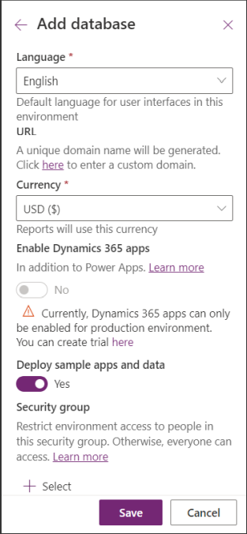

# Power Platform

# App in a Day

## Lab Overview and Pre-requisites

#### Abstract

This is a beginner level lab for you to get hands on experience with the Microsoft Power Platform technologies – Power Apps, Power Automate, and Microsoft Dataverse. The lab includes step-by-step instructions for someone new to these technologies to build a device ordering solution within a day. Technologies covered are:

**Power Apps:** A software as a service (SAAS) application platform that enables power users in line of business roles to easily build and deploy custom business apps. You will learn how to build Canvas and Model-driven style of apps.

**Power Automate:** A business service for line of business specialists and IT pros to build automated workflows intuitively.

**Microsoft Dataverse:** Makes it easier to bring your data together and quickly create powerful apps using a compliant and scalable data service and app platform that is integrated into Power Apps.

Make sure to follow all the pre-requisite steps listed in this document before starting the labs. Because the Power Platform
is a cloud-based solution, you can complete all labs remotely.

For a list of additional learning resources and introductory videos, see Learning Resources.


### Task 1 : Install the Power Apps and Power Automate mobile applications (optional)

1. **Install the Power Apps mobile application** : Go to the app store on your mobile device. Search for “ **Power**
    **Apps** ” and install the Power Apps mobile application. If prompted, keep push notifications enabled.
2. **Install the Power Automate mobile application** : Go to the app store on your mobile device. Search for “ **Power**
    **Automate** ” and install the application. If prompted, keep push notifications enabled.

### Task 2: Create a new environment and Microsoft Dataverse database instance

You must have a newly created Microsoft Dataverse environment and database instance, that was **created just for this
lab.** If you don’t have a new environment or have an older environment, follow the steps below to create the environment
and provision the database instance.

1. Open the Power Apps admin center by navigating to the below URL in a web browser.

   ```
   http://admin.powerapps.com/
   ```
1. Sign in to thr admin center using the below credentails.

    * Azure Username/Email: <inject key="AzureAdUserEmail"></inject> 
    * Azure Password: <inject key="AzureAdUserPassword"></inject>
      
1. In the Admin center, select **Environments** and click **+New**.

   
   
1. Provide a name for the environment. A common practice is to use your name followed by “Test” so it is clear this
    is a test environment.
1. Select **Trial** , select your **Region** , make sure **Create a database** is set to **Yes** , and click **Next**.

   
   
1. Select your **Language** and your **Currency**. Check **Yes** for **Deploy sample apps and data**, and then click **Save**.
  
   
   
   > Note : You can choose your local language and currency. However, the lab manuals were created using US dollars and
English language configurations.
1. You will see a screen listing all environments that will show the newly created environment.

   
   
1. **IMPORANT** : You need to wait for the database to finish provisioning before trying to create an application. The
    **Status** will change to Ready when done. 

   
   
1. This may take few minutes to complete. Wait for it to complete before proceeding with creating an app. If it has
    been over two minutes, try refreshing the browser. Once the database has been created you should no longer see
    this “Preparing Instance” message. You can then proceed with the lab.
