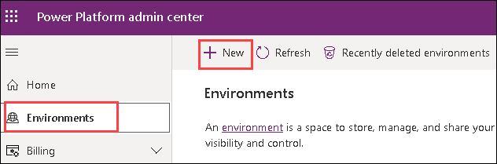
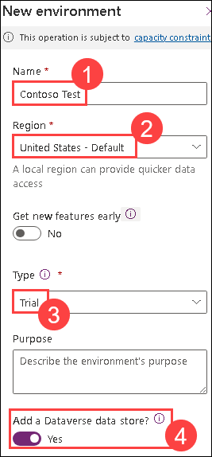
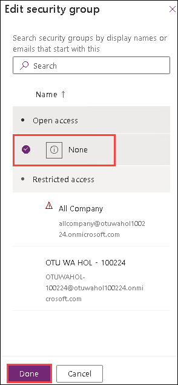
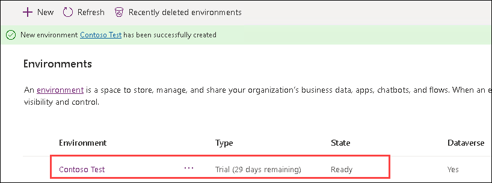

# Power Platform

# App in a Day

## Lab Overview and Pre-requisites

#### Abstract

This is a beginner level lab for you to get hands on experience with the Microsoft Power Platform technologies – Power Apps, Power Automate, and Microsoft Dataverse. The lab includes step-by-step instructions for someone new to these technologies to build a device ordering solution within a day. Technologies covered are:

**Power Apps:** A software as a service (SAAS) application platform that enables power users in line of business roles to easily build and deploy custom business apps. You will learn how to build Canvas and Model-driven style of apps.

**Power Automate:** A business service for line of business specialists and IT pros to build automated workflows intuitively.

**Microsoft Dataverse:** Makes it easier to bring your data together and quickly create powerful apps using a compliant and scalable data service and app platform that is integrated into Power Apps.

Make sure to follow all the pre-requisite steps listed in this document before starting the labs. Because the Power Platform
is a cloud-based solution, you can complete all labs remotely.

For a list of additional learning resources and introductory videos, see Learning Resources.


### Task 1 : Install the Power Apps and Power Automate mobile applications (optional)

1. **Install the Power Apps mobile application** : Go to the app store on your mobile device. Search for “ **Power**
    **Apps** ” and install the Power Apps mobile application. If prompted, keep push notifications enabled.
2. **Install the Power Automate mobile application** : Go to the app store on your mobile device. Search for “ **Power**
    **Automate** ” and install the application. If prompted, keep push notifications enabled.

### Task 2: Create a new environment and Microsoft Dataverse database instance

You must have a newly created Microsoft Dataverse environment and database instance, that was **created just for this
lab.** If you don’t have a new environment or have an older environment, follow the steps below to create the environment
and provision the database instance.

1. Open the Power Apps admin center by navigating to the below URL in a web browser.

   ```
   http://admin.powerapps.com/
   ```
1. Sign in to the admin center using the below credentails.

    * Azure Username/Email: <inject key="AzureAdUserEmail"></inject> 
    * Azure Password: <inject key="AzureAdUserPassword"></inject>
      
1. In the Admin center, select **Environments** and click **+New**.

   
   
1. Provide the following details:

   - Name: **Contoso Test (1)**
   - Region: **United States (2)**
   - Type: **Trial (3)**
   - Add a Dataverse data store? Check the box to **Yes (4)**

      

1. Click on **Next**.

1. Provide the following details and then click **Save**:

   - Language: **English (1)**
   - Currency: **USD ($) (2)**
   - Click on **Security Group** and select **None** under Open Access and click on **Done**.
   - Check **Yes (3)** for **Deploy sample apps and data**
  
      

      
   
   > **Note:** If  **Deploy sample apps and data** option is disabled for you, this is due to unpredicted behavior of Power Apps, follow the below steps to enable the option. 
    1. In the Admin center, select **Environments** and click **+New**.
    2. Select **Sandbox/Production** , select your **Region** , make sure **Create a database** is set to **Yes** , and click **Next**.
    3. Select your **Language** and your **Currency**. Notice that **Deploy sample apps and data** is enaled now, and then click **cancel**.
    4. Repeat the steps 2-5 to create a **Trial** environment.

1. You will see a screen listing all environments that will show the newly created environment.

   
   
      > **IMPORANT:** You need to wait for the database to finish provisioning before trying to create an application. The **Status** will change to Ready when done. 

   > **Note:** This may take few minutes to complete.
