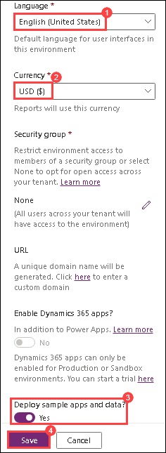

# Pre- Requisites

### Estimated Duration: 10 minutes

## Overview

This beginner-level lab provides hands-on experience with Microsoft Power Platform technologies—Power Apps, Power Automate, and Microsoft Dataverse. Designed for those new to the platform, the lab guides you step-by-step to build a device ordering solution in a day. You will explore Power Apps to create Canvas and Model-driven apps, use Power Automate to design intuitive automated workflows, and leverage Microsoft Dataverse for compliant, scalable data management. Complete all pre-requisites before starting, as the cloud-based Power Platform allows you to complete the lab remotely. 

## Lab objectives

In this lab, you will complete the following tasks:

- Task 1: Install the Power Apps and Power Automate mobile applications (Optional)
- Task 2: Create a new environment and Microsoft Dataverse database instance

### Task 1: Install the Power Apps and Power Automate mobile applications (Optional)

1. **Install the Power Apps mobile application** : Go to the app store on your mobile device. Search for “ **Power**
    **Apps** ” and install the Power Apps mobile application. If prompted, keep push notifications enabled.
2. **Install the Power Automate mobile application** : Go to the app store on your mobile device. Search for “ **Power**
    **Automate** ” and install the application. If prompted, keep push notifications enabled.

### Task 2: Create a new environment and Microsoft Dataverse database instance

You must have a newly created Microsoft Dataverse environment and database instance, that was **created just for this
lab.** If you don’t have a new environment or have an older environment, follow the steps below to create the environment
and provision the database instance.

1. Open the Power Apps admin center by navigating to the below URL in a web browser.

   ```
   http://admin.powerapps.com/
   ```
1. Sign in to the admin center using the below credentails.

    * Azure Username/Email: <inject key="AzureAdUserEmail"></inject> 
    * Azure Password: <inject key="AzureAdUserPassword"></inject>
      
1. In the Admin center, select **Environments** and click **+New**.

   
   
1. Provide the following details:

   - Name: **Contoso Test (1)**
   - Region: **United States (2)**
   - Type: **Trial (3)**
   - Add a Dataverse data store? Check the box to **Yes (4)**

      

1. Click on **Next**.

1. Provide the following details and then click **Save**:

   - Language: **English (1)**
   - Currency: **USD ($) (2)**
   - Click on **Security Group** and select **None** under Open Access and click on **Done**.
   - Check **Yes (3)** for **Deploy sample apps and data**
  
      

      
   
   > **Note:** If  **Deploy sample apps and data** option is disabled for you, this is due to unpredicted behavior of Power Apps, follow the below steps to enable the option. 
    1. In the Admin center, select **Environments** and click **+New**.
    2. Select **Sandbox/Production** , select your **Region** , make sure **Create a database** is set to **Yes** , and click **Next**.
    3. Select your **Language** and your **Currency**. Notice that **Deploy sample apps and data** is enaled now, and then click **cancel**.
    4. Repeat the steps 2-5 to create a **Trial** environment.

1. You will see a screen listing all environments that will show the newly created environment.

   
   
      > **IMPORANT:** You need to wait for the database to finish provisioning before trying to create an application. The **Status** will change to Ready when done. 

   > **Note:** This may take few minutes to complete.

### Summary

In this exercise, you have created a new environment and Microsoft Dataverse database instance.

### You have successfully completed the lab
