# Module 1: Power Apps Canvas App

### Estimated Duration: 120 Minutes

## Overview

This lab showcases how Microsoft Business Application Platform technologies enable citizen developers to build a customized device ordering solution. Using Power Apps, participants will design an interface to browse, filter, compare devices, and submit orders with custom forms. Power Automate will streamline approval workflows, sending automated requests to managers and allowing approvals directly via email. Microsoft Dataverse will securely store order data and enable admins to manage and view all orders. The solution ensures a seamless user experience with notifications for approvals/rejections and supports a tailored procurement process for device purchases.

## Lab objectives

In this lab, you will complete the following tasks:

- Exercise 1: Create the app in Power Apps
- Exercise 2: Add Device Gallery and Connect to Data Source
- Exercise 3: Add Compare Screen

## Exercise 1: Create the app in Power Apps

**IMPORTANT:** Do not proceed before going through the lab pre-requisite steps.

### Task 1: Sign-in to Power Apps web studio

1. Navigate to Power Apps Portal using the below URL and click Sign-in. You may also directly navigate to Make Power Apps.

   ```
   http://powerapps.microsoft.com/
   ```
      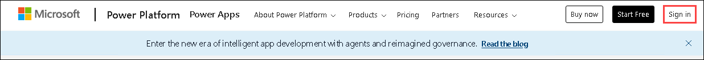     

2. Login to the account using the below credentials.

    * Azure Username/Email: <inject key="AzureAdUserEmail"></inject> 
    * Azure Password: <inject key="AzureAdUserPassword"></inject>
    
3. Click on the **Environment** drop down and select the **Contoso Test** environment whihch we created in the previous task.

      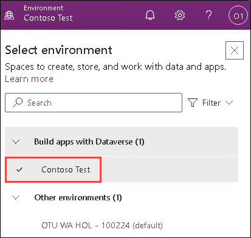

      > **Note:** If your environment doesn't show up, try logging out and logging in again

### Task 2: Create a new application

1. In the home page, click on the search bar and search for canvas app and select **Canvas app from blank** from the dropdown.

      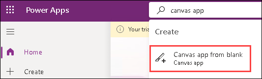
   
1. Click on **Create**.
 
1. Input **Device Ordering App (1)** in the App Name field, Select **Tablet (2)** for the Format and click on **Create (3)**.

      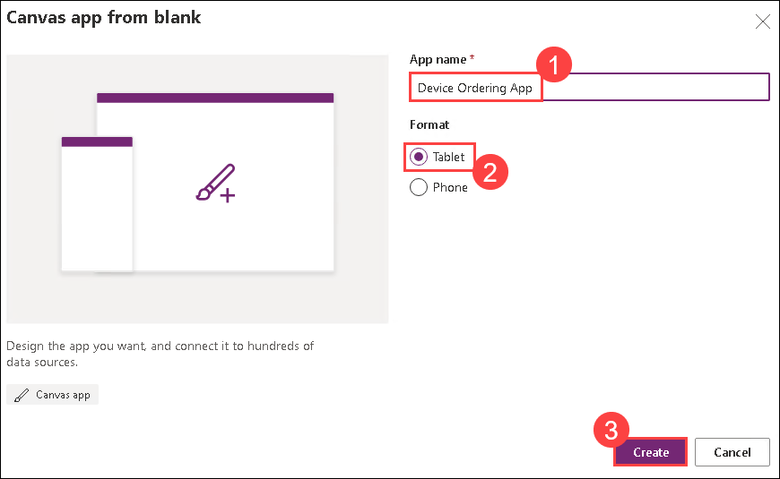
   
      > **Note:** If prompted, select your region, then click **Get started**.

      > **Note:** It takes few minutes to complete. Refresh the page after few minutes.
 
1. Click on **Skip** if you receive the **Welcome to Power Apps Studio** prompt.

### Task 3: Rename the screen

In this task, you will rename Screen1 to Main Screen.

1. Select the screen by clicking the **Screen1** tile in the **Tree view**.

2. Click on the **Ellipsis (...)** beside the **Screen1** and select the **Rename** option.

      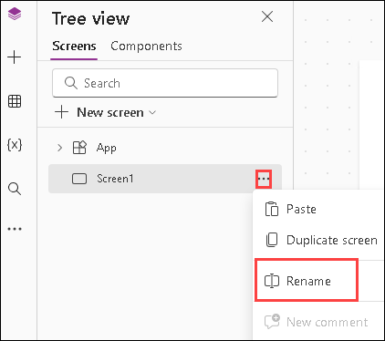

3. Change the name to **Main Screen.**

### Task 4: Add a header containing the app name and logged in user’s name

1. With Main Screen selected, click on the **+ Insert** button.

      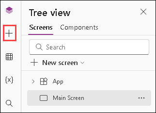
   
2. Drag **Text Label** from the Insert pane and drop it on the Main Screen.

     
   
3. Select the **Tree View** tab.
   
4. Rename Label1 to **Header Label** , see the previous task on renaming controls.

     
   
5. Select **Text** from the property drop-down list and enter **"Device Ordering App"** in the formula bar. You can also
   type directly in the label.

   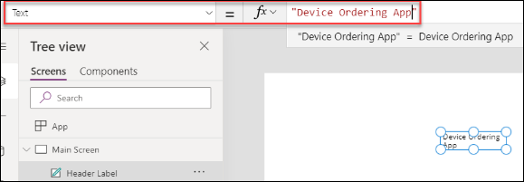  
   
6. Resize the label such that the width is the width of the screen and the height is a reasonable size for a header. You
   can resize the label by either dragging the corners of the label or adjusting the size in the Right Pane.

     
   
7. Align center the text.

     
   
8. From the top, select the more options icon ,change the **Color** to White and the **Background Color** to Blue.

      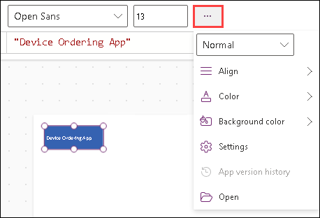
   
9. Change the **Font Size** to 24.

      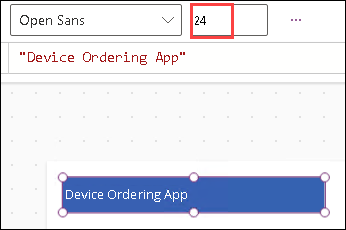

10. Select **+ Insert** button and drag another **Text Label** to the Main Screen. You will use this label to display the
    logged in user’s name.

      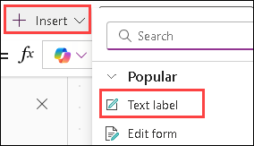
   
11. Drag the label to the far-right side of the screen as shown and center the label vertically to be in line with the
    header text. As you center your label, purple alignment markers will appear.

      
   
12. Rename the label to **User Label**.

13. Change the value of the Text field to: "Hello, " & User().FullName

      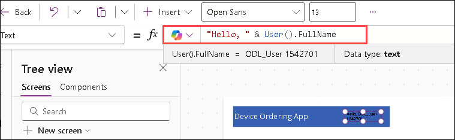

14. Right-align the text in the label by selecting the **Align** and **Align Right** option in the **Home** tab on the ribbon.

15. Change the text **Color** to **White**.

16. Widen the label, so the text does not wrap for longer usernames.

17. Change the **PaddingRight** property from **5** to **20**. You can do this quickly using the Properties pane on the right
    side.

      

### Task 5: Save the Application

In this task, you will save an initial version of the app. It is a good practice to keep saving app updates at regular intervals.

1. First, you will check if there are any errors. Click on then **App Checker** icon.

      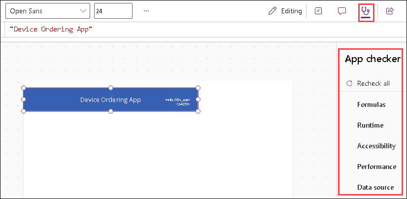 
   
2. The **App Checker** pane will come to view. Errors will be displayed here if there are any.

3. Close the **App Checker** pane.
   
4. Click on **Settings**.

      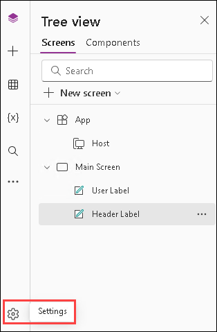

5. In the application settings page, you can:

     - Change your app name
     - Customize the app icon – choose a background color and icon

      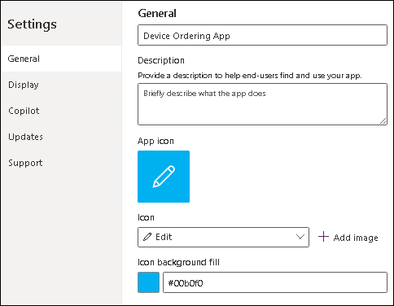

6. Select the **Display** tab to view the available screen orientation and aspect ratio settings. For this app, we will leave
    it at the default setting of Landscape with 16:9 aspect ratio.

      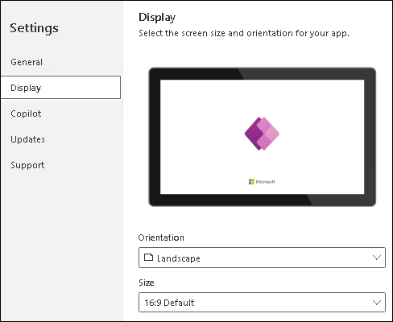
   
7. Close the **Settings**.

8. Click on **Save** from the top right.

      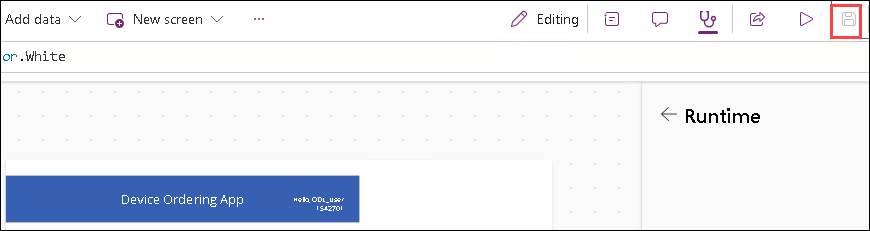

## Exercise 2: Add Device Gallery and Connect to Data Source

In this exercise, you will add a gallery of all available devices making it easy for users to browse the list and get a quick
overview of the devices available.

### Task 1: Add device gallery

1. With Main Screen selected, select the **+ Insert** tab.

2. Type **Horizontal** and select **Horizontal Gallery**.

      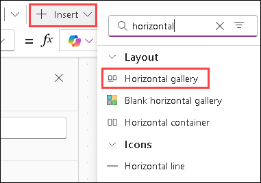
   
3. Expand **Connectors** , then click **Show all connectors**.

      

4. Select **Import from Excel.**

      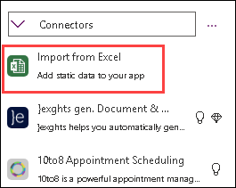

5. In the File Open dialog, browse to the location `C:\LabFiles\PowerApps-in-a-day` inside the LabVM and select **Device-Order-Data.xlsx** to load it.

6. Select both tables, **Devices** and **Manufacturers,** and click the **Connect** button. This will add both these tables as
static data into the application.
    
      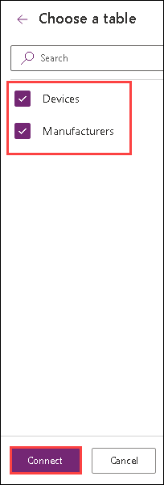

   > **Note** : In this lab, you will work with tables imported from a static data file and embedded as resources in the app. If you
were building a real solution, the same tables would likely be stored in the cloud, such as in a SharePoint list, a SQL table,
or a Microsoft Dataverse table.

8. Select **Gallery1** and notice the **Items** property is set to **Devices**. Notice the gallery is populated with data.

      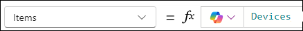

9. Rename the **Gallery1** to **Device Gallery**.

      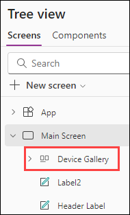

### Task 2: Arrange the device gallery

1. Resize and reposition the gallery. You can drag and drop the gallery or use the gallery properties pane on the right.

      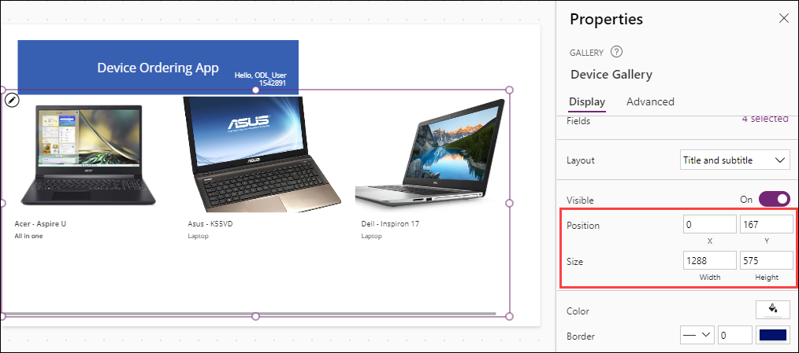
 
2. Select the **Device Gallery** and click the **Edit (pencil) icon** in the top left to edit the template cell.

      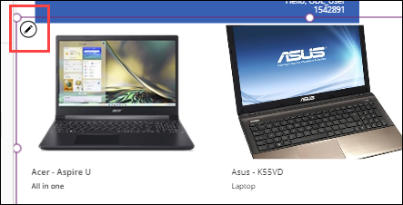
 
3. Using the right drag control, resize the first box to be narrower. Notice that all the items get narrower and more devices are visible on the screen.
       
4. Narrow the image as well by **clicking on the image control and resizing it using the drag handles**. Make sure the width of the image control is positioned within the template. 

5. Notice the gallery control on our screen automatically has scrolling capabilities.

      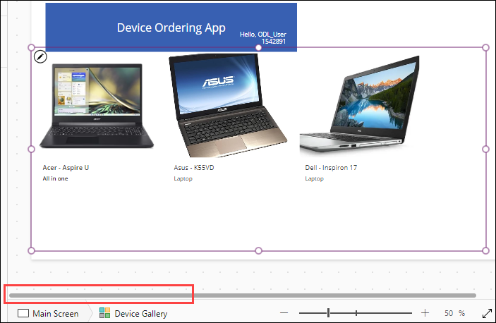
   
### Task 3: Add gallery to show manufacturers

1. Select the **Main Screen**.

2. Select the **Insert (1)** tab, **search (2)** for Vertical and click on **Vertical Gallery (3)**

      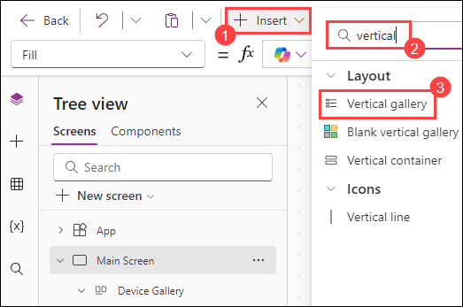

3. Select **Manufacturers** for the data source.

    
 
4. Rename the gallery to **Manufacturer Gallery**.

    
 
5. Move this new gallery so that it is left aligned with the left edge of the screen and top aligned with the top of the device gallery. Your two galleries should like the image below.

      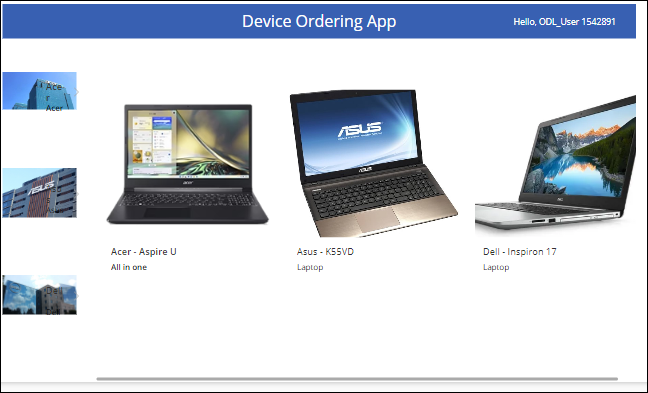

6. Select **Manufacturer Gallery (1)** (not just the template cell), in the **Properties** tab on the right, click **Layout (2)**. Scroll down to the **Gallery** section and select **2 Columns (3)**.
   
      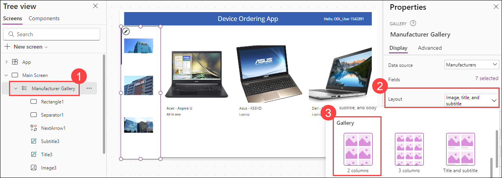
 
7. Change the **Wrap Count** from **2** to **1**. This will change it to a single column gallery.

    

8. Select the **image control** within the gallery (the Edit Pencil icon) and **reduce its height** by dragging the middle bottom drag control upwards. If you select the first image, the image size will reduce whereas the template size will still be expanded.

9. Reduce **the height of the template cell** until three or four images occupy the gallery without scrolling. We
    essentially want the image to occupy the entire cell.

      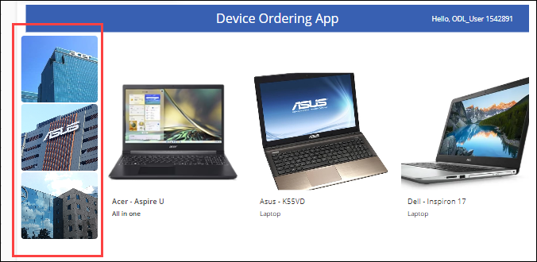
   
10. Click on **Save** from the top right.
    
### Task 4: Connect Manufacturer Gallery to manufacturers table

Earlier you connected the data source using the Data tab in the right pane. You can also connect to data via the formula
bar.

1. Select the **Manufacturer Gallery**. Make sure the whole gallery is selected and not just the first cell.

2. Select **Items** from the property drop-down next to the formula bar. Notice that the gallery is populated with images of buildings. This is because Power Apps picked a default binding which mapped to the HQ column in the table.
  
      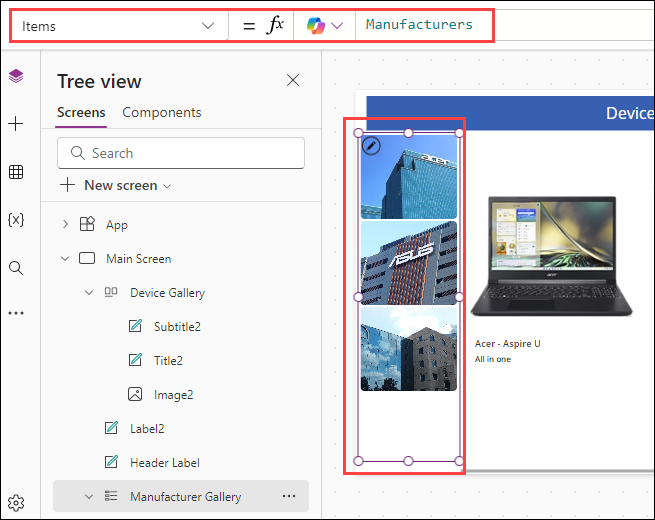
   
3. Select the image control in the first template cell in the gallery and change the value of **Image** in the formula bar from **ThisItem.HQ** to **ThisItem.Logo**. All the gallery items will now display logo images. You can also use the left tree view to select the controls, sometimes that is easier!

      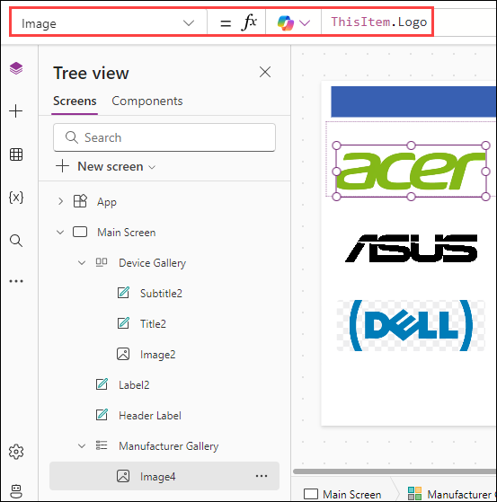
    
4. Select the first (top-most) image and using the **Properties** pane on the right, set the **Image position** property to **Fit**.

      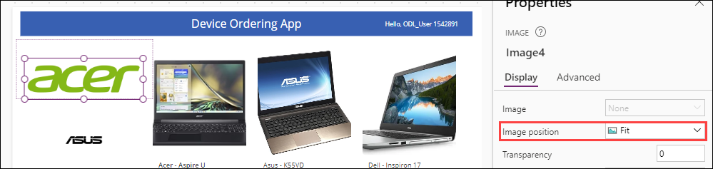

5. Reduce the height of the template cell such that all nine manufacturers fit without a scrollbar. To do this, use the drag handles to first reduce the height of the image and subsequently reduce the height of the template cell. Note again that to select the template cell, select the entire gallery and click on the pencil icon in the top left.
   
###  Task 5: Highlight the selected item in the gallery

1. With the **Manufacturer Gallery** selected, set the **TemplateFill** property on the gallery to the following formula to conditionally set the fill color of the selected cell to light blue:
   
    ```
    If(ThisItem.IsSelected,LightBlue)
    ```

    > Alternately, you could set the TemplateFill property to:

     ```
     If(ThisItem.IsSelected,ColorFade ('Header Label'.Fill,75%))
     ```
      This approach is recommended so the fill color matches the header label with a 75% fade. If you change the fill
color of header label, the fill color of the selected item in the gallery will automatically change.

      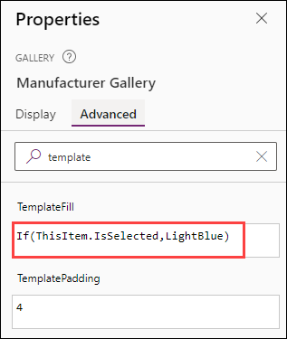

2. Now try using the preview mode to perform a quick test of this highlighting. You can enable preview mode by holding down the Alt key (also known as the Option key) and clicking a few different manufacturers in the gallery, notice the selected item in the manufacturer gallery is highlighted in a light blue color. The preview mode ends when you stop holding the key.

### Task 6: Configure text labels in the device gallery

1. Select the subtitle in the **Device Gallery**. It may already have the default value set to the **DeviceType** property
    (e.g. Tablet).

2. Let us now change the label to display the device price by setting the label’s Text property to: **ThisItem.Price**

      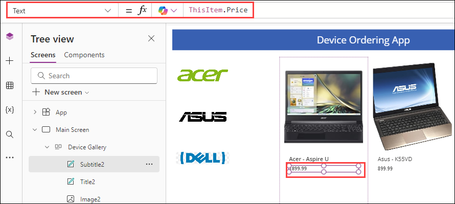 
   
1. To add the $ to the Subtitle, use the Text format expression: Text(ThisItem.Price,"$##,###.00") or for alternate/European locales: **Text(ThisItem.Price;"$##.###,00")**.

     > **Note:** After you enter the above value in the formula bar, it will automatically resolve to include your locale, e.g. [$-en-
US]. If you see an error here, it might be because your locale is not yet supported, in which case as a workaround, manually change it to [$-en-US]:

      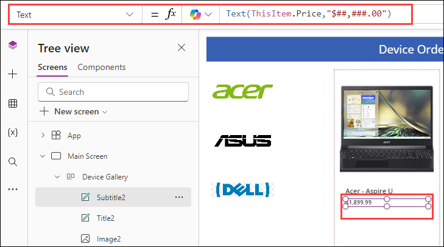
   
3. Select the **Title1**.

4. In the property drop-down list, select the **Text** field and change to **ThisItem.Title**.

      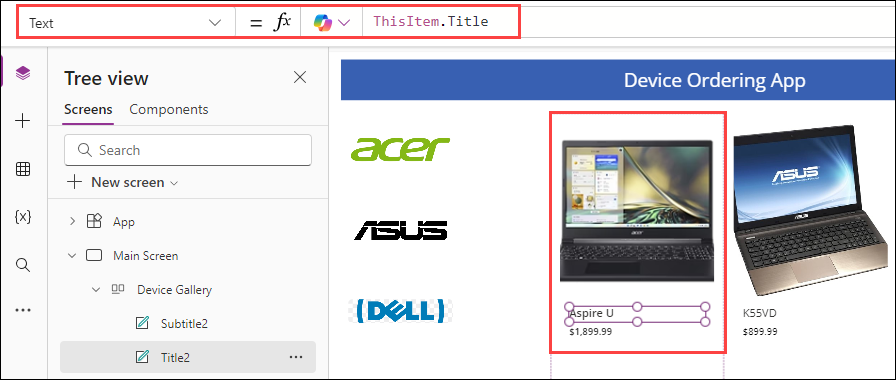

### Task 7: Add a checkbox to add a device to Compare list

1. Select the **Device Gallery** , click the Pencil edit icon in the top left of the gallery to select the template cell.
   
2. Make sure that only the first item in the gallery is selected (not the entire gallery).
 
3. Add a checkbox by clicking **Insert (1)**, search for **check (2)** and click on **Checkbox (3)**.

      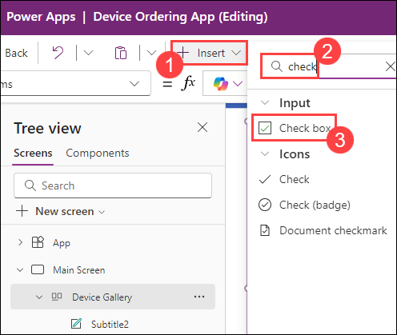

4. Move the inserted checkbox below the price.
   
5. Change the checkbox text to **“Compare”.** You can do this by setting the **Text** property.

      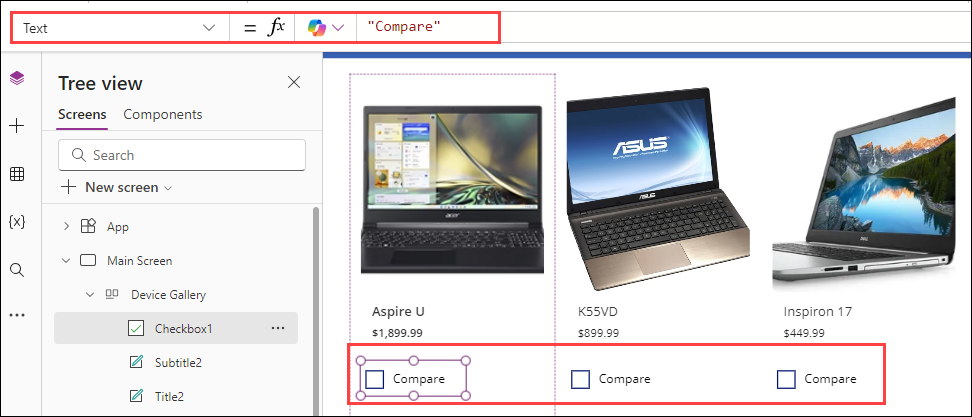
   
### Task 8: Create a collection for the selected devices

1. Select the **Checkbox** control and click on the **Action** tab in the ribbon, click **OnCheck** and set the value in the formula bar to: Collect(CompareList,ThisItem)

      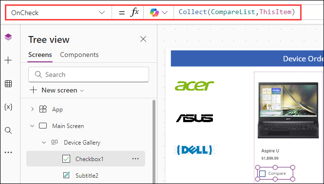
   
2. Set the **OnUncheck** value to: Remove(CompareList,ThisItem).This is required to make sure the unchecked items are removed from the collection.
  
3. Set the **Default** property of the checkbox to the formula: ThisItem in CompareList

4. Let’s test out adding items to a collection by running the app in Preview (F5) or by clicking the Preview button on
    the top right. Click on the checkboxes of three devices.

      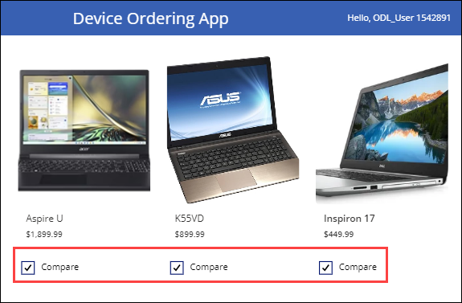
   
5. Close the preview.

6. Click on **Variables (1)** from the left navigation pane, click on **CompareList (Table: 3 rows) (2)** and select on **View Table (3)**.

      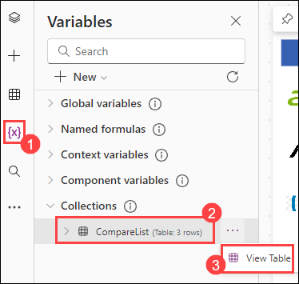
   
7. You will see the **CompareList** collection and the three items you selected.

      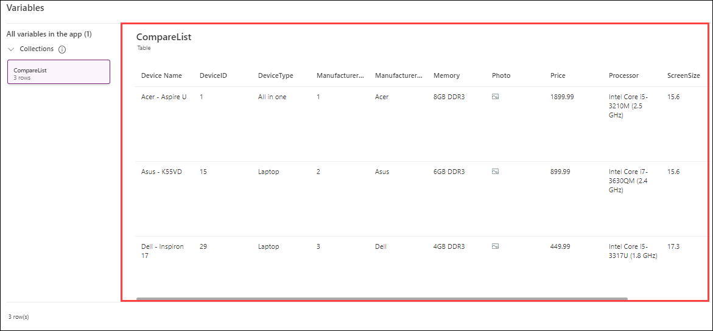
   
8. Click the back arrow on the top left to get back to the main view.

9. Click **Preview** again.

10. Uncheck all the checked items and click on close the preview.

11. Click on **Variables** from the left navigation pane, click on **CompareList** again.
   
11. All items will be removed from the **CompareList** collection.

12. Click on then back arrow.

### Task 9: Set the default selection to the first manufacturer and test the app

1. Select the entire gallery (by clicking **Manufacturer Gallery** in the tree view on the left) and set the **Default** property of the gallery in the formula bar to: First(Manufacturers). This will set it to the first item in the table.

      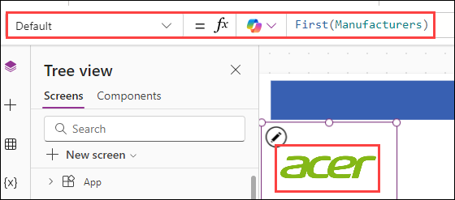

2. To preview the app, press the Preview button on the upper right of the top menu. Pressing the F5 key will also preview the application. 
   
3. To exit preview mode, click the X in the top right corner.

    
   
4. **Save** the application.

### Exercise 3: Add Compare Screen

The second screen is where users compare the selected devices and then choose the one they wish to submit for approval.

This screen will include:

- A back button for navigation back to the main screen.

- A list of selected devices for comparison (carried over from the main screen).

- Additional details for each device.

- Highlighting the selected device

In a subsequent lab, you will create the database entities to store the device orders and add an edit form to this screen to
enter additional information and submit the request.

### Task 1: Add screen

1. From the tree view, click on **New Screen (1)** and choose **Blank (2)**.

      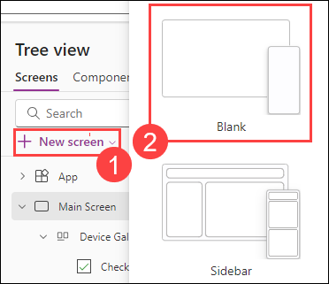
   
2. Rename the screen to **Compare Screen**.
   
3. Click on the **Insert (1)** tab from the top select the **Main Screen** , **search (2)** and **select (3)** Button.

      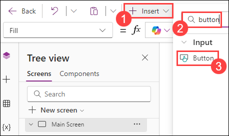

4. Place the button in the bottom right corner.

      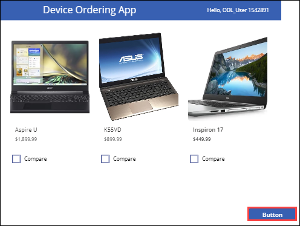

5. Set the button’s **Text** property to: "Compare " & CountRows(CompareList) & " item(s)"

      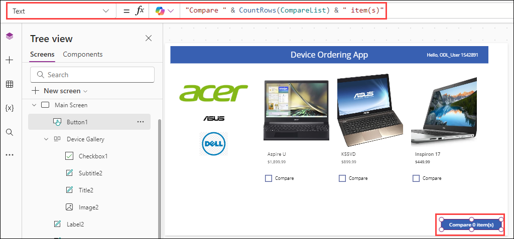
   
6. Resize the button, so the text fits without wrapping.

    

7. Select the button and set its **DisplayMode** property to Disabled if there are no items in CompareList: If(CountRows(CompareList) > 0, DisplayMode.Edit, DisplayMode.Disabled). Unselect all devices – notice the button is grayed.

      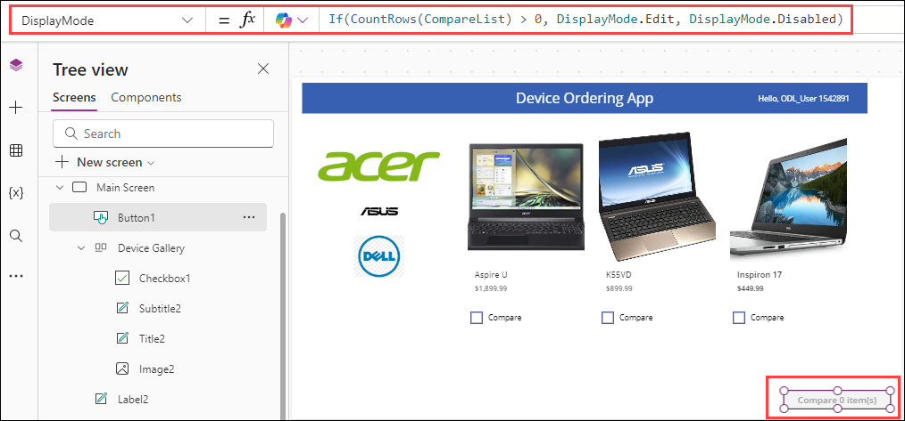
   
8. Select the **compare button** and **copy (Ctrl-C)** this button.
   
9. **Paste (Ctrl-V)** the button on the same screen.

10. Position it to the left of the compare button.

    

11. Change the **Text** property to "Clear Selection"

12. Set the **OnSelect** property for this button to: Clear(CompareList). This will remove all the items in the CompareList collection.

      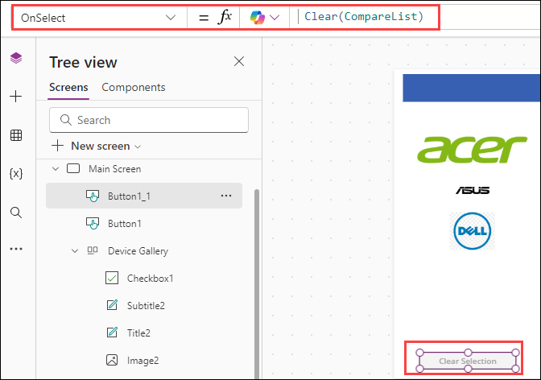

13. Select the **Button1** from the left navigation pane, Change the **On Select** property to **Navigate ('Compare Screen)**.

      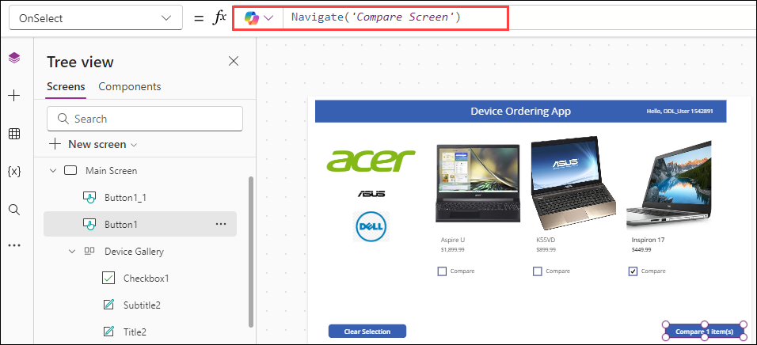

14. Click **Preview**.

15. Select a couple of devices and click the **Compare** button and verify that it takes you to the second screen.

      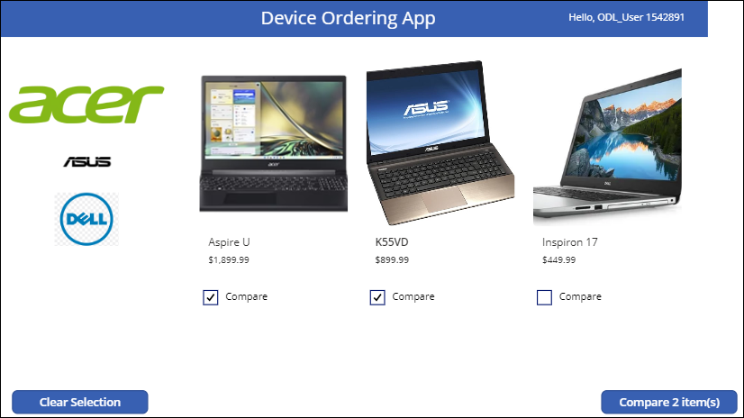
   
16. You should navigate to the new empty screen. Close the preview.

    
   
17. Go to the **Main Screen** in the tree view.

18. Select both the **User Label and Header Label (1)** , right click and select **Group (2)**.

      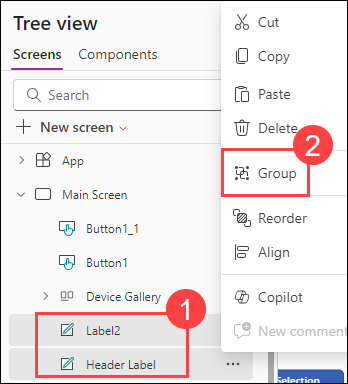
   
19. Rename the group **Header**.

20. Click on the ... button of the **Header** and select **Copy**.

21. Right click on the **Compare Screen** by and select **Paste**.
   
22. The **Header** in the **Compare Screen** should look like the image below.

    
   
23. Copy **Device Gallery** from the **Main Screen** and paste it in the **Compare Screen**.

26. Move the gallery to the left edge of the screen. Align the top of the gallery to be just under the header banner. Use the right drag handle to reduce the width of the gallery and create space for a data entry form on the right of the screen. You will insert a Form control here and configure it in a subsequent lab.
   
27. Rename this gallery to **Compare List Gallery**.

    

### Task 2: Configure the gallery

1. Select the new **Compare List Gallery**.

2. Select **Items** in the property drop-down list and change the data source in the formula bar to CompareList.

      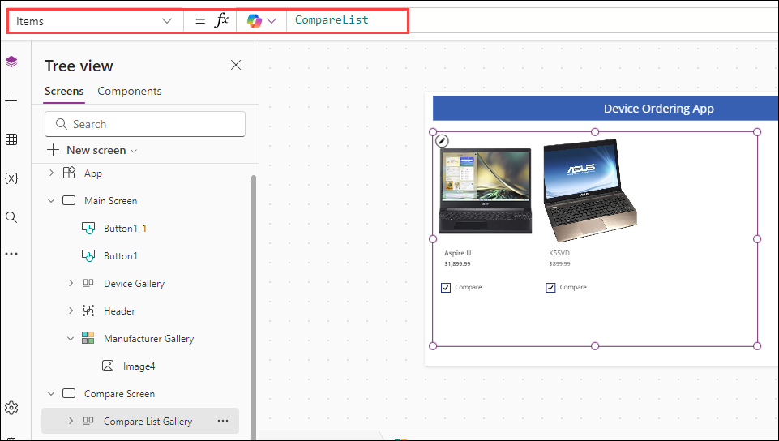
   
3. The gallery will now show the selected items from the Main Screen.
   
### Task 3: Remove and add controls to the gallery

1. Select the **Compare checkbox** on the left most template cell and press the **Delete** key to delete the checkbox.

2. Now let’s add a few labels to display additional attributes about the device. A good way to do this is to copy paste. Select the **first label** in the gallery that is displaying the device name. Copy it **(Ctrl-C)** and paste it **(Ctrl-V)**. Rename these labels as you go for ease of use later.

      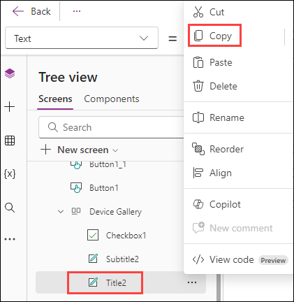

3. Move the new label so that it is just below the price. Set the **Text** property to: ThisItem.ManufacturerName.

      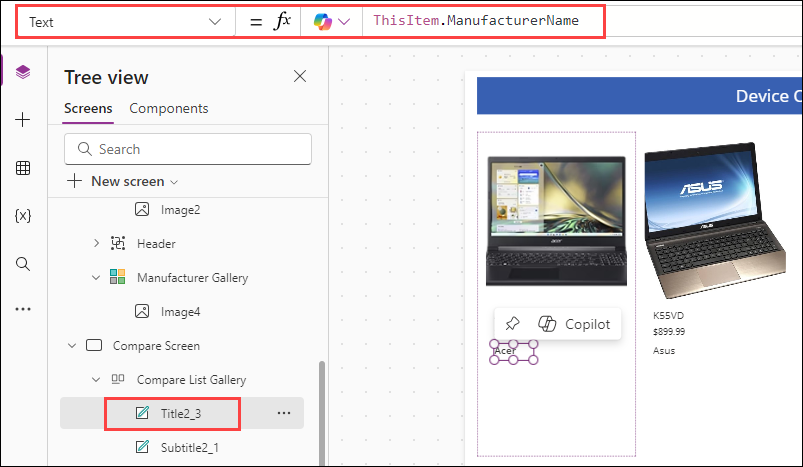
   
4. Use the ribbon to change the font weight from **Semibold** to **Normal** and change the **Size** property from 20 to 18.

    
   
5. Copy and paste this label and move the new fourth label below the third label. Set its **Text** property to: ThisItem.Memory

      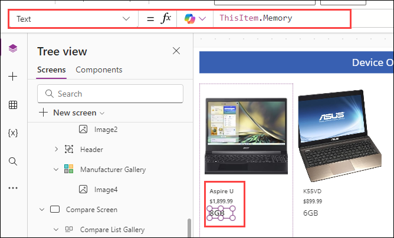
   
6. Repeat this and add text boxes to display the additional device properties – Processor, Storage, ScreenSize, etc.

### Task 4: Highlight the selected device

1. Select the **Compare List Gallery.**

2. With the whole gallery selected, set the **TemplateFill** property to:

   ```
   If(ThisItem.IsSelected,ColorFade('Header Label'.Fill, 75%))
   ```
   
      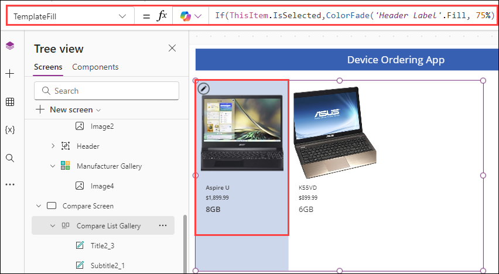

3. Holding down **Alt** , click a few different items in the gallery, notice the selected item is highlighted in a light blue color.

### Task 5: Add an icon to navigate to the first screen

1. Select the **Compare Screen**.

2. Go to **Insert (1)** , **Search (2)** for **Left** and **select (3)** it. Position it in the upper left corner of the screen.

      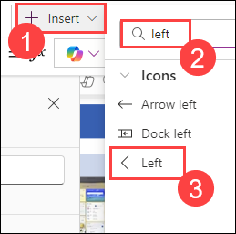

3. Select the arrow control, change the **Color** property to **White**. You can change this in the formula bar or through the **Properties** pane on the right.

      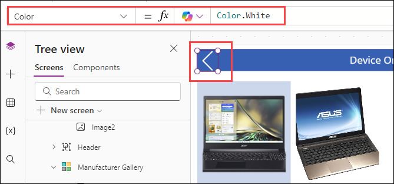
   
4. Move the arrow to the top-left corner.

      
   
5. Set the **OnSelect** action for the icon to Back(). This will cause navigation back to the previous screen.

      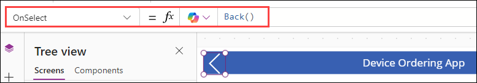

###  Task 6: Test the app

1. Go to the **Main Screen** and **Preview** the app by hitting the **Play** button in the top right.
   
1. Uncheck if there are any checked devices.

1. Select the checkbox for the laptop that you would like to compare. Click the **Compare** button to navigate to the compare screen.

      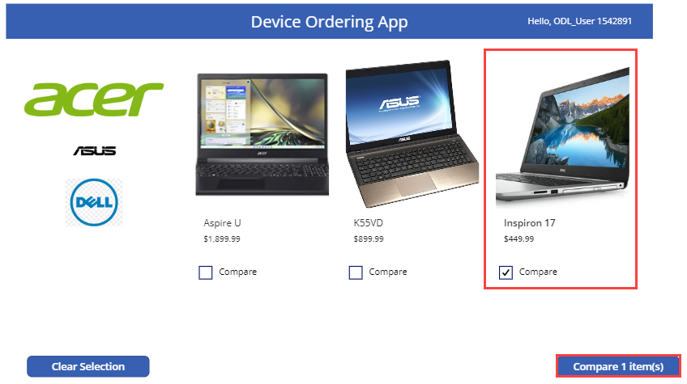

1. Click the **Back** button and confirm you get back to the main screen.

      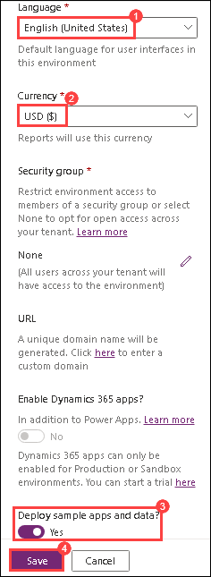
   
1. Click on **Clear Selection**. 

1. The **CompareList** will clear, and the **Compare** button will become disabled.
   
1. Close the preview.

### Task 7: Test the app on a mobile device

1. Click on **Save** from the top righr.

2. **Click** on the **Publish** button.

      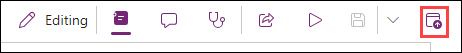

3. Click **Publish this version** on the confirmation prompt.

      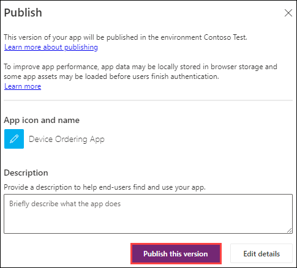

## Summary

In this exercise, you have created the app in Power Apps, added Device Gallery and Connect to Data Source and added Compare Screen.

### You have successfully completed the lab!
