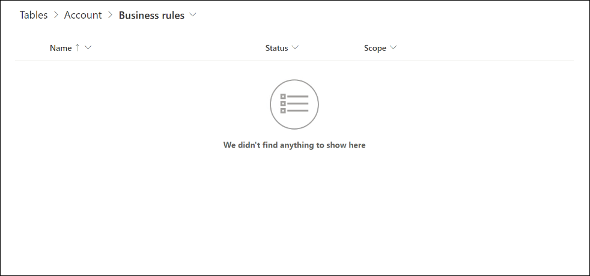
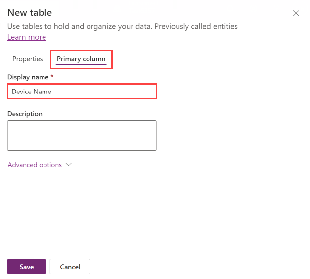
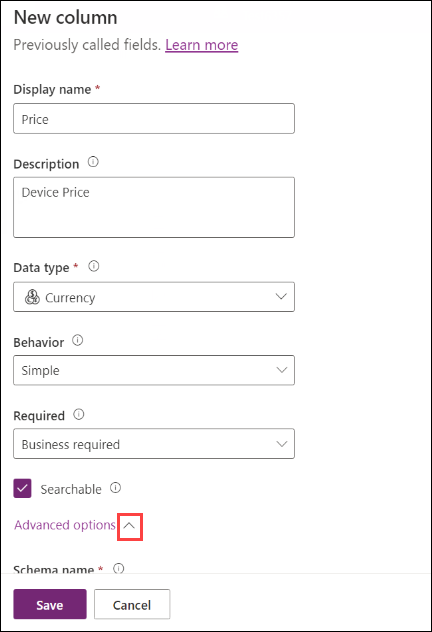
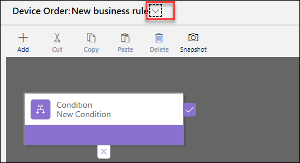
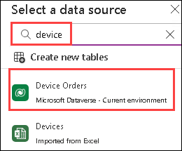
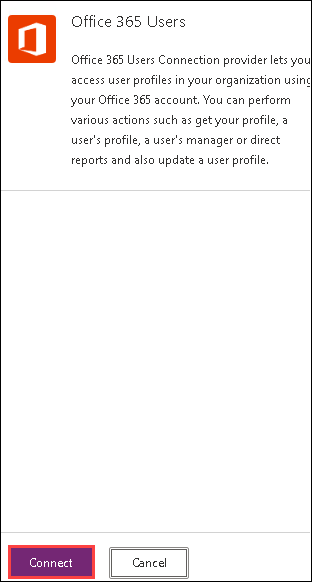
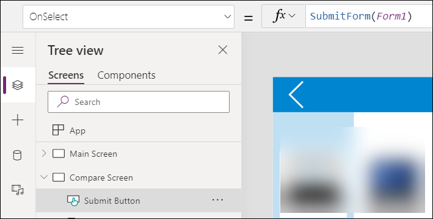
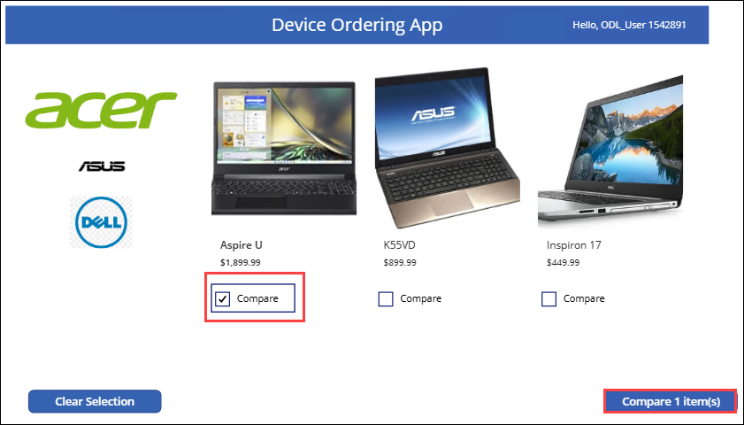
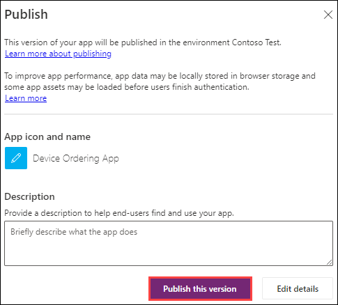

# Module 2: Microsoft Dataverse

### Estimated Duration: 120 minutes

## Overview

The Microsoft Dataverse adds data storage and modeling capabilities to Power Apps that is scalable and easy to provision.
In this module, you will be using Microsoft Dataverse to model and store the data from the device ordering canvas app
that you built in module 1. In the next module, you will be building a model-driven application using the same data that
will be used by the back-office staff to process the device orders. These apps that you build on Microsoft Dataverse use
the same technology framework (Microsoft Dataverse) that Microsoft Dynamics 365 apps are built-on.

## Lab objectives

In this lab, you will complete the following tasks:

- Exercise 1: Exploring Microsoft Dataverse
- Exercise 2: Custom Tables and Columns
- Exercise 3: Connect the data from the Canvas App

## Exercise 1: Exploring Microsoft Dataverse

In this exercise, you will explore Microsoft Dataverse standard Tables. Tables in Microsoft Dataverse are like tables in a
database or worksheets in Microsoft Excel. Tables can be connected together with relationships that model real world
interactions between the tables. Each table contains multiple Rows (Records), each having data columns. For example, a
“Project” table may have columns such as Name, Due Date, Status, etc. and it may be related to a “Project Owner” table
which might have columns such as Name, Email, etc.

Microsoft Dataverse abstracts a lot of the typical low-level database management work to make it easier for you to
configure a custom data model that fits your application.

In addition to allowing for the creation of custom Tables, Microsoft Dataverse contains a Common Data Model (CDM)
consisting of hundreds of standard table definitions. You can find the current CDM schema here: `https://github.com/Microsoft/CDM` and
you can browse the CDM using the CDM Visual Table Navigator located here: `https://microsoft.github.io/CDM/`. You can read more about the
CDM here: `https://docs.microsoft.com/powerapps/common-data-model/overview`.

### Task 1: Explore standard Tables

```
https://make.powerapps.com/
```

1. Select **Tables** from the left pane.

2. This will bring up the list of Tables in this database instance. Click on a few of the standard Tables (for example,
    **Account** ) to get familiar with some of the features of an table.
    
    

**Columns** :

A table has a list of columns. In the example below, the “Account” table has columns such as Account Name, Account
Number, etc. Each column has a data type, such as Text, Number, etc. The data type is chosen when you create a column
and is not changeable. The data type also defines many of the characteristics and behaviors of the column when your
application runs. For example, a Choice allows you to have a pre-defined list of values for use in your application. When
this column is used on a form in a model-driven application the visual presentation is a drop-down control. The column
helps to ensure data consistency and allows for built-in support for multi-language applications.

To have a detailed view of all the available columns for the table, select **Columns** under **Schema**.

   
  
  

You can find a list of Microsoft Dataverse supported data types here: `https://docs.microsoft.com/en-us/powerapps/maker/common-data-service/types-of-fields`

**Relationships:**

Relationships allows you to manage relationships between Tables. Relationships supported are One to Many (1:N), Many
to One (N:1) and Many to Many (N:N). Relationships also define the behavior that happens when actions occur on the
primary Row in a 1:N relationship. For example, if the parent Row is deleted you can configure the relationship behavior
so that all child Rows are also deleted or simply remove the reference.

Note: You will need to select the **Relationships** option from the **Columns** dropdown to view available relationships.

  
  
  


**Business rules:**

Building a Business Rule is like building a flowchart where you can define conditions and actions. You can learn more
about Business rules here: `https://docs.microsoft.com/dynamics365/customer-engagement/customize/create-business-rules-recommendations-apply-logic-form`

 Note: You will need to select the **Business rules** option from the **Columns** dropdown to view available Business rules. 

   
   
  


**Views:**

Views will let you define how a list of Rows are shown in the app. You can create multiple custom views, each having their
own filtering and sorting criteria. For example, you could create a view to see only the Rows created in the last week and
another one to see Rows that haven’t been updated in a year. Create views to make the application users more
productive in filtering their data.

 Note: You will need to select the **Views** option from the **Columns** dropdown to see available views. 
 
  
  
  


**Forms:**

Forms provide the user interface that people use to interact with the data they need to do their work. It's important that
the forms people use are designed to allow them to find or enter the information they need efficiently. You can create
different types of forms like Quick Create, Quick View, Card, and a Main form. For some of these forms you can have more
than one version, to accommodate for different user roles within your organization.

 Note: You will need to select the **Forms** option from the **Columns** dropdown to view available Forms. 
 
  
  
  


**Dashboards** :

Dashboards helps you bring your views, charts, and web resources together in one place.

 Note: You will need to select the **Dashboards** option from the **Columns** dropdown to view available dashboards. 
 
  

  


**Charts** :

Use Charts to display high-level view of your data in insightful and graphical ways.

 Note: You will need to select the **Charts** option from the **Columns** dropdown to view available charts. 
 
  
  
  


**Keys** :

Allows you to view the lookup keys for the table. Keys can contain multiple columns to define a composite key. Keys
enforce uniqueness, so they should not be used when there is a need to store duplicate values of columns used.

 Note: You will need to select the **Keys** option from the **Columns** dropdown to view available keys. 
 
  
  
  


**Commands** :

Microsoft Dataverse allows you to create your own command bar buttons. The commands added to this table will be listed
here.

 Note: You will need to select the **Commands** option from the **Columns** dropdown to view available commands. 
 
   
   
   
   


**Data:**

You can view and search the data in the table. This gives you a quick way to see some of the data for the table without
having to jump into a specific Canvas or Model-driven app.

   


### Task 2: Explore Standard Choices

Just like standard Tables, the Microsoft Dataverse includes a set of standard **Choices**. You can also create custom **Choices**.
Later in this lab, we will create a custom **Choice** called **ApprovalStatus** to set the approval status of a device order.

1. From the left navigation pane, click on **... More** and select **Choices**.

    

2. Examine the standard **Choices.**

   


## Exercise 2: Custom Tables and Columns

In this exercise, you will create a new custom table named Device Order and add columns necessary to track the device
requests. You will also create a server-side Business Rule that will default the estimated ship date.

### Task 1: Create a custom table

In this task, you will create a custom table to store device order requests.

1. Select **Tables** in the left pane and click on **New Table**. Select **Table (advanced properties)** from the dropdown.

    
   
2. Enter **Device Order** for Display Name.

3. Click on Primary column and Change the **Primary Column Display Name** to **Device Name**.
    
   

4. Click on **Save**.

### Task 2: Create custom columns

In this task, you will create custom columns for the Device Order table. It may take a few minutes for your new Device
Order table to provision. Begin these steps once it has finished.

1. Click on **+ New** and select **Columns**.

2. Provide the following details and click on **Save**:
   - Display Name: **Price**
   - Description: **Device Price** 
   - Data Type: **Currency** 
   - Required: **Business Required**
   - Ensure the checkbox for **Searchable** is checked
   - Click on **Advanced Options**
   - Minimum Value: **0**
   - Maximum value: **5000**

   

   

5. Click on **New Column** again.

6. Enter **Requested By** for **Display Name** , **Single line of text** for **Data Type**, **Email** for **Format** , make the column
    **Searchable** and click on **Save**.
   
   

7. Now repeat the Add Column process and add the following columns

    |    Display Name     |       Type      |
    | ------------------- | ----------------- |
    |    Request Date     |   Date Only   |
    |     Approver        |   Email       |
    |     Comments        |   Plain Text  |
    | Estimated Ship Date |   Date Only   |
    |    Approved Date    |   Date Only   |

8. Click on **Add Column** again.

9. Enter **Approval Status (1)** for **Display Name** , select **Choice (2)** for **Data Type** , scroll down and select **New Choice** under **Sync this choice with**.
  
    
 
10. Inside the New Choice, provide the name as **Approval Status (1)**. Enter two choices, provide the names as **Approve and Reject (2)** and click on **Save (3)**. 

    

11. Back in the New Column tab, the new choice **Approval Status (3)** will be selected under **Sync this choice with** and click on **Save (4)**.

    

### Task 3: Create a calculated column

In this task, you will add a Department Contribution column and set its value to 10% of the price. In our scenario, this is
the amount that will come from the department manager’s budget. Calculated columns are special columns that
automatically perform the calculation when the data is retrieved. When you create or modify a calculated column you set
the formula used in the calculation.

1. In the upper left corner of the screen, click on **Add Column** to add columns to your custom table.

1. Enter **Department Contribution (1)** for **Display Name** , **Currency (2)** for **Data Type** , select **Calculated (3)** for **Behaviour** field and click on **Save (4)**.

    

1. If you have not yet allowed popups from Power Apps, you will be prompted to do so now.

1. Once the **Department Contribution** has been created, select it and click on **Edit** that is present under **Behaviour**.

   
   
1. You will be presented with a new pop-up to add actions and conditions. Now, click **Add Action**.

   

1. Type price and select the **Price** column you created.

   

1. Add `*0.1` and click the **Check Mark** button.

   

1. Click on **Save and Close.**

   

1. Click on **Done**.

    

### Task 4: Create a business rule

In this task, you will create a **Business rule** that will set the Estimated Delivery Date to 14 days after approval of the order.

1. Select the **Business rules** tab and click **Add business rule.**

   

2. Click the arrow to **Show Details**.

   

3. Change the **Name** to **Calculate Ship Date** and click the arrow to **Hide Details**.

   

4. Select the **Condition** , change the name to **Check Ship Date**.

   

5. In the **Rule 1** section select **Entity** for **Source** , **Approved Date** for **Column** , **Contains Data** for **Operator** and click
    **Apply**.

    > **_Note:_** _You may need to scroll down to the bottom of all scroll bars to see the Apply button. You must click Apply after any
change to the properties otherwise they will revert to the prior value. The Business Rule (Text View) will automatically update
after you hit apply when you are done modifying the rule._

    
    

6. Click **Add** , select **Add Set Field Value**.

   

7. Select the True side of the condition.

    

8. Enter **Set Estimated Ship Date** for **Display Name** , select **Estimated Ship Date** for **Column** , **Formula** for **Type** ,
**Approved Date** for **Column** , **+** for **Operator** , **Value** for **Type** , **14** for **Days** , and click **Apply**.

      

9. Click on **Validate** from the top right.

      

10. Make sure validation succeeds.

       

11. Click on **Save**.

      

12. Click on **Activate**.

      

13. Confirm activation. Business rules only execute when they are activated. In the future to make changes to rules
    you deactivate them, make the change, and then re-activate the rule.

      

14. Close the process editor browser window or tab.

15. Click **Done**. The list should refresh showing the Business Rule you just created.

       

16. Your Device Order table will have one Business Rule.

      
 
## Exercise 3: Connect the data from the Canvas App

Now that you have created the table to store device order requests let’s connect your Device Ordering Canvas app to this
table and add a form to submit device approval requests.

### Task 1: Add Microsoft Dataverse table as a data source to the app

1. Select **Apps** , select the **Device Order App (1)** you created in Module 1, and click **Edit (2)**.

      

1. Click on Override.

      

1. Select the **Data(1)** from the left navigation pane to display the current sources. Select **Add Data (2)**. Search for **device (3)** and click on **Device Orders (4)**

      

### Task 2: Create the edit form

1. Switch to the **Tree view** and select the **Main Screen**.

   

2. Select few devices. Hold the “Alt” key, and then it will allow you to check the compare on the devices.

      

3. Select the **Compare Screen**. You should now have the selected devices.

      

4. Select the **Insert** tab, search for **forms (1)** and select **Edit form (2)**.

      

5. Click the **Data Source** drop-down in the Data pane on the right.

6. Select the **Device Orders** table as the data source.
 
      

7. Add, remove, and order fields like the list below. The fields are added using the plus sign and can be reordered by
dragging the field to the desired placement.
    a. Device Name
    b. Price
    c. Approver
    d. Comments
    e. Requested By
    f. Request Date


10. Move the form control **Form1** to the right of the screen and resize it using the drag handles such that it fits in the
    empty space. See picture on the right. Make sure there is enough space below the form to add a Submit button.

    > **Note** : You can always select controls, such as the Form1 control, from the tree view on the left to make sure you are
selecting the correct control. To move it make sure you select the Form and not a control within the form.

11. Change the **Snap to columns** setting from 3 to 1. This will modify the layout of the edit form to be single
    column.

    


12. To create a new instance of the form when the screen is loaded. Click **Compare Screen** in left tree view pane.

    

13. Select the **OnVisible** property of the screen, enter: **NewForm(Form1)**

    

### Task 3: Configure the title column

1. Expand the **Device Name_DataCard1** present in the left navigation pane under Form1.

2. Select **Device Name DataCardValue** in the tree view. Then, open the **Advanced** tab in the right-hand pane.

   

3. Click **Unlock** so you can customize the card

   

4. Go to the **Data** section and set the **Default** property to the below value:

    ```
    'Compare List Gallery'.Selected.ManufacturerName & " - " & 'Compare List Gallery'.Selected.'Device Name'
    ```
    
    

5. Change the **DisplayMode** to **DisplayMode.View.** This will prevent users from changing the value within the text
    box.

   

### Task 4: Configure the price Field

1. Expand **Price_DataCard1** data card.

2. Select the **Data Card Value**.
  
   

3. Select the **Advanced** tab and click **Unlock**.

   

4. Change the **Default** property in the Data section to: Text('Compare List
    Gallery'.Selected.Price,"$##,###.00")

   

5. Select the Price Field and change the **DisplayMode** property to DisplayMode.View.

   

### Task 5: Configure the Approval Field

1. Select **Data** from the left navigation pane. Click on **Add data** , then expand Connectors. Search and Select **Office 365 Users**.

   

2. When prompted, click **Connect**
   
   

3. Select the **Approver Data Card** from the Tree view.
   
   

4. Go to the **Advanced** pane and **Unlock**.

5. Set the **Default** value to: User().Email This expression will use your user’s email, so you won’t accidentally e-
    mail your manager to approve your testing.

6. Save your work and return to the continue editing the app.

### Task 6: Configure the Comment Field

1. Expand the **Comments** Field and select the **DataCardValue**

2. Set its **HintText** property to: “Enter justification.”

   

### Task 7: Configure the Requested By Field

1. Expand the **Requested By** card.

2. Select the **DataCardValue.**

3. Go to the **Advanced** pane and **Unlock** the card.

4. Change the **DisplayMode** property to: DisplayMode.View

   

5. Set the **Default** value to User().Email
    This is the email of the currently logged in user

   

### Task 8: Configure the requested date Field

Let’s set the Request Date to be today’s date.

1. Expand the **Request Date** card.

2. Select the **DateValue** card.

   

3. Go to the **Advanced** pane and **Unlock** the card.

4. Change the **DefaultDate** property to Today()

   

   > Notice that the date in the calendar control will change to today’s date. Now we will hide the Request Date card. We don’t need to show this Field to the user. Since we have included it as part of the form the Field will get updated as part of the form submit.

5. Select the **Request Date DataCard**

   

6. Go to the **Properties** pane.

7. Set the **Visible** toggle to **Off**.

   

### Task 9: Add a button to submit the form

1. Select the **MainScreen**.

2. Copy (Ctrl-C) the **Compare button** from the first screen which has the correct color values.

   

3. Go back to the **Compare Screen** and paste (Ctrl-V) the button.

   

4. Position it in the bottom right of the screen, center aligned with the Form.

5. Make sure the button is larger – you can resize to 280x60 using the Properties pane on the right.

   

6. Set the button’s **Text** property to **“Submit device request”**
   
   
   
7. Rename the button to **Submit Button**.

   

8. The button should be enabled only if a device is selected. To do this, change the button’s **DisplayMode** property
    to: If(!IsBlank('Compare List Gallery'.Selected), DisplayMode.Edit, DisplayMode.Disabled)
   
   
   
   > Note: You might notice the exclamation mark (!) in the formula !IsBlank() Normally if you just have IsBlank() the
check is for blank. Adding the exclamation mark (!) in front of it changes it to check if it is NOT blank.

9. Next, we are going to configure what we want to happen when the button is clicked. Set the **OnSelect** property
    to SubmitForm(Form1).

   

    > Info: When the button is pressed, the form data will be submitted to the Microsoft Dataverse.

10. Save your work and return to continue editing the app.

### Task 10: Test the form

1. Select the **Main Screen** in the left side tree navigation and click Play.

2. Select the first device to compare. And click **Compare**.

   

3. Notice that the Title, Price, Approver, and Requested By Fields are already filled in.

4. Change the Approver email to your own email for test purposes. Use the Odl e-mail ID present in the Environment Tab.

5. Add some **Comments** , such as: “Current laptop does not work, need a new device.”

   

6. Click on **Submit device request.**

   

   > Info: The button should turn disabled (gray) for a few seconds while it’s submitting the request. If it does not do this
there is likely an error. Click the X in top right to get back to the design mode. If there is an error, you will see a yellow error icon next to the Submit button, hover over it to check the error.

7. Exit the preview mode (‘X’ in top right).

8. Save the Application and Publish.

   

### Task 11: Verify a new item was added to the Device Order table

1. Open a browser window, go to Power Apps portal using the below URL.

   ```
   http://make.powerapps.com/
   ```

2. Navigate to **Tables** from the left navigation pane.

3. Select the **Device Order** table.

4. On the **Device Order** table overview blade, you should see a newly added row with your device order details under **Device Order columns and data**. This may take a few seconds to load.

   

## Summary

In this exercise, you have explored Microsoft Dataverse, created custom Tables and Columns and connected the data from the Canvas App.

### You have successfully completed the lab!
