# Power Platform

# App in a Day

Module 2: Microsoft Dataverse

### Hands-on Lab Step-by-Step
April 2022

- Microsoft Dataverse Contents
   - Lab Prerequisites
   - Before you begin
   - Overview
   - Goals for this lab
- Exercise 1: Exploring Microsoft Dataverse
   - Task 1: Explore standard Tables
   - Task 2: Explore Standard Choices
- Exercise 2: Custom Tables and Columns
   - Task 1: Create a custom table
   - Task 2: Create custom columns
   - Task 3: Create a calculated column
   - Task 4: Create a business rule
- Exercise 3: Connect the data from the Canvas App
   - Task 1: Add Microsoft Dataverse table as a data source to the app
   - Task 2: Create the edit form
   - Task 3: Configure the title column
   - Task 4: Configure the price Field
   - Task 5: Configure the Approval Field
   - Task 6: Configure the Comment Field
   - Task 7: Configure the Requested By Field
   - Task 8: Configure the requested date Field
   - Task 9: Add a button to submit the form
   - Task 10: Test the form
   - Task 11: Verify a new item was added to the Device Order table
   - Task 12: [Optional] Navigate to confirmation screen after the Form submit is successful

Microsoft Dataverse

### Lab Prerequisites

This is the second lab in a series covering Power Apps Canvas Apps, Microsoft Dataverse, Power Apps Model-driven Apps,
and Power Automate. The assumption is that you have successfully completed the initial part of setting up an environment
as described in the overview document – “ **00 - AppInADay Lab Overview.pdf** ”.

If you have not completed building the Power Apps Canvas App in Module 1, you can use the partially completed version
of the lab package in the “\Completed\Module1” folder. Follow the instructions in the document “Importing Module 1
Completed” before proceeding with this module.

### Before you begin

You must be connected to the internet.

1. **Have a Test Environment with permission to create a Microsoft Dataverse database:** You should have
    gone through the steps to create a new environment using the Admin center. In this lab, you will create a
    database in this environment, if you haven’t already created one.
2. **Sign-in to Power Apps:** Go to Power Apps and **sign in** with the same account you used to complete the first
    lab**.** Make sure you switch to the environment where you created the app.

### Overview

The Microsoft Dataverse adds data storage and modeling capabilities to Power Apps that is scalable and easy to provision.
In this module, you will be using Microsoft Dataverse to model and store the data from the device ordering canvas app
that you built in module 1. In the next module, you will be building a model-driven application using the same data that
will be used by the back-office staff to process the device orders. These apps that you build on Microsoft Dataverse use
the same technology framework (Microsoft Dataverse) that Microsoft Dynamics 365 apps are built-on.

### Goals for this lab

After this lesson you will be able to:

-^ Provision a Microsoft Dataverse^ database^
- Create a custom table and add custom columns to it
- Use the Power Apps Form control to populate the table
-^ View the table^ data^
-^ Create a calculated column^
-^ Implement a server-side business rule

The time to complete
this lab is [ 60 ]
minutes.

## Exercise 1: Exploring Microsoft Dataverse

In this exercise, you will explore Microsoft Dataverse standard Tables. Tables in Microsoft Dataverse are like tables in a
database or worksheets in Microsoft Excel. Tables can be connected together with relationships that model real world
interactions between the tables. Each table contains multiple Rows (Records), each having data columns. For example, a
“Project” table may have columns such as Name, Due Date, Status, etc. and it may be related to a “Project Owner” table
which might have columns such as Name, Email, etc.

Microsoft Dataverse abstracts a lot of the typical low-level database management work to make it easier for you to
configure a custom data model that fits your application.

In addition to allowing for the creation of custom Tables, Microsoft Dataverse contains a Common Data Model (CDM)
consisting of hundreds of standard table definitions. You can find the current CDM schema at [Github Microsoft CDM](https://github.com/Microsoft/CDM) and
you can browse the CDM using the CDM Visual Table Navigator located here [Github CDM](https://microsoft.github.io/CDM/). You can read more about the
CDM here [Common Data Model Overview](https://docs.microsoft.com/powerapps/common-data-model/overview).

### Task 1: Explore standard Tables

In this task, you will explore Microsoft Dataverse standard Tables.

Before beginning the exercises, navigate to [Make Power Apps](http://make.powerapps.com/) and confirm that you are in the desired environment for the
labs.

   

1. In the left pane, expand **Dataverse** and select **Tables**.

   

2. This will bring up the list of Tables in this database instance. Click on a few of the standard Tables (for example,
    **Account** ) to get familiar with some of the features of an table.
    
    

_For detailed documentation on Microsoft Dataverse Tables, see_ https://docs.microsoft.com/en-
us/powerapps/developer/common-data-service/reference/about-entity-reference

**Columns** :

A table has a list of columns. In the example below, the “Account” table has columns such as Account Name, Account
Number, etc. Each column has a data type, such as Text, Number, etc. The data type is chosen when you create a column
and is not changeable. The data type also defines many of the characteristics and behaviors of the column when your
application runs. For example, a Choice allows you to have a pre-defined list of values for use in your application. When
this column is used on a form in a model-driven application the visual presentation is a drop-down control. The column
helps to ensure data consistency and allows for built-in support for multi-language applications.

To see all the columns for the table, change the default view in the top right corner to show all, or once you reach the
bottom of the list you can click Remove Filter.

  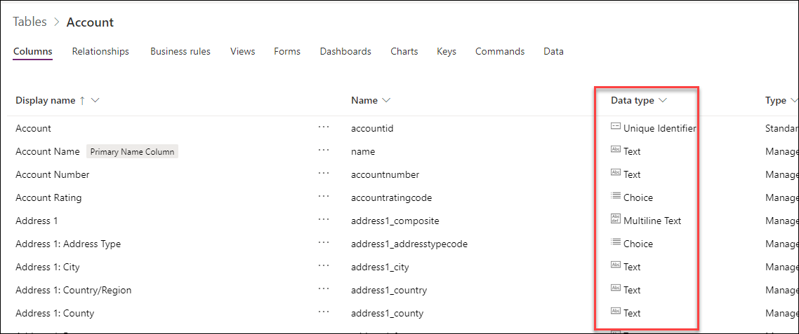

_For a list of supported data types, see [Microsoft Dataverse Supported Data Types](https://docs.microsoft.com/en-us/powerapps/maker/common-data-service/types-of-fields)_

**Relationships:**

Relationships allows you to manage relationships between Tables. Relationships supported are One to Many (1:N), Many
to One (N:1) and Many to Many (N:N). Relationships also define the behavior that happens when actions occur on the
primary Row in a 1:N relationship. For example, if the parent Row is deleted you can configure the relationship behavior
so that all child Rows are also deleted or simply remove the reference.

Note: You will need to click the Relationships tab to see relationships. If you don’t see any relationships, click the Reset the
Filter button.

  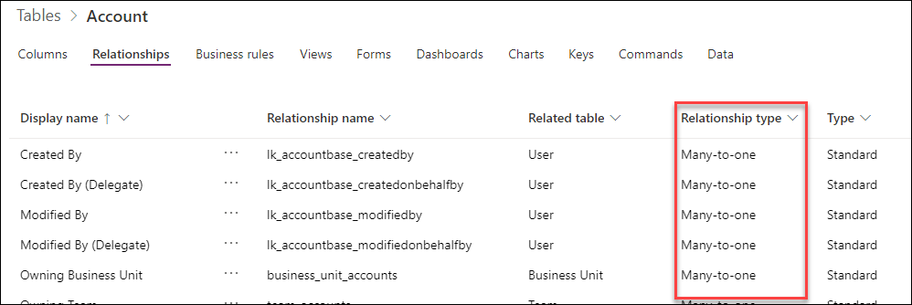

**Business rules:**

Building a Business Rule is like building a flowchart where you can define conditions and actions. You can learn more
about Business rules in the link below.

_Business Rules Recommendations:_ [Business Rules Recommendations](https://docs.microsoft.com/dynamics365/customer-engagement/customize/create-business-rules-recommendations-apply-logic-form)

   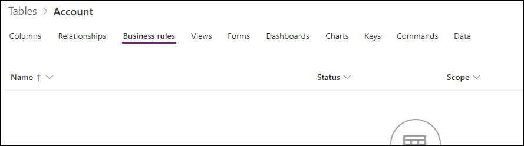

**Views:**

Views will let you define how a list of Rows are shown in the app. You can create multiple custom views, each having their
own filtering and sorting criteria. For example, you could create a view to see only the Rows created in the last week and
another one to see Rows that haven’t been updated in a year. Create views to make the application users more
productive in filtering their data.

  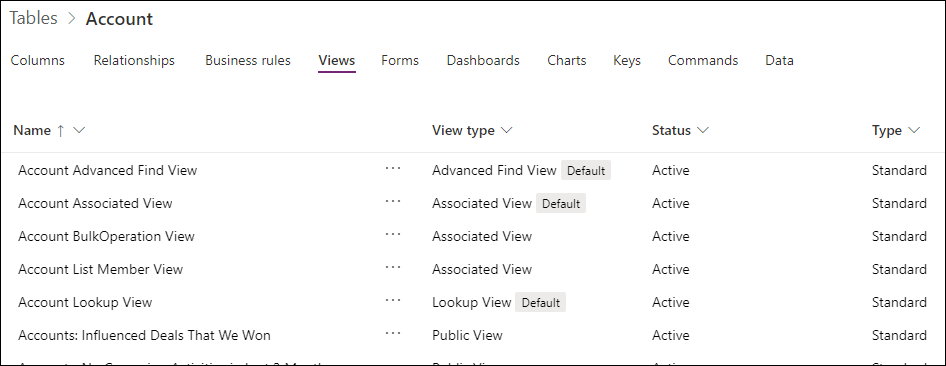

**Forms:**

Forms provide the user interface that people use to interact with the data they need to do their work. It's important that
the forms people use are designed to allow them to find or enter the information they need efficiently. You can create
different types of forms like Quick Create, Quick View, Card, and a Main form. For some of these forms you can have more
than one version, to accommodate for different user roles within your organization.

  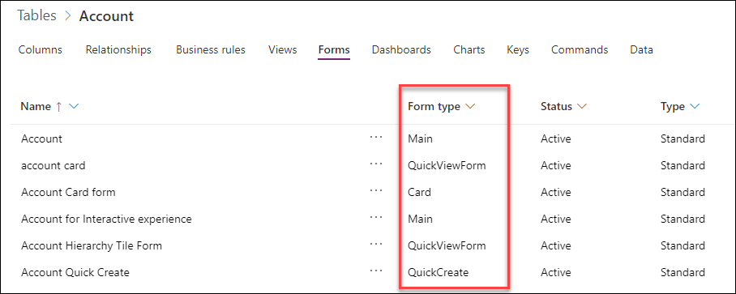

**Dashboards** :

Dashboards helps you bring your views, charts, and web resources together in one place.

**Charts** :

Use Charts to display high-level view of your data in insightful and graphical ways.

  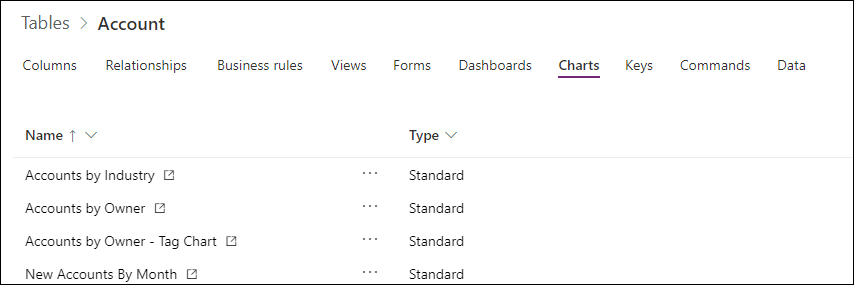

**Keys** :

Allows you to view the lookup keys for the table. Keys can contain multiple columns to define a composite key. Keys
enforce uniqueness, so they should not be used when there is a need to store duplicate values of columns used.

  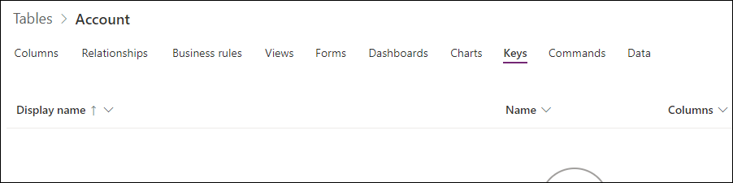

**Commands** :

Microsoft Dataverse allows you to create your own command bar buttons. The commands added to this table will be listed
here.

   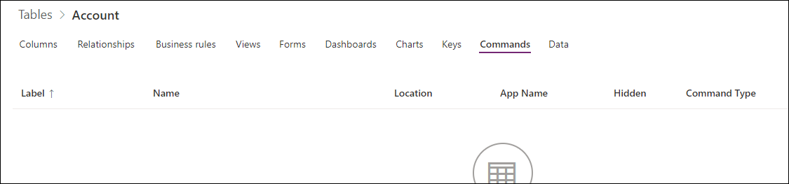

**Data:**

You can view and search the data in the table. This gives you a quick way to see some of the data for the table without
having to jump into a specific Canvas or Model-driven app.

   

### Task 2: Explore Standard Choices

Just like standard Tables, the Microsoft Dataverse includes a set of standard **Choices**. You can also create custom **Choices**.
Later in this lab, we will create a custom **Choice** called **ApprovalStatus** to set the approval status of a device order.

1. Select **Choices** from underneath the expanded **Dataverse.**

   

2. Examine the standard **Choices.**

   

## Exercise 2: Custom Tables and Columns

In this exercise, you will create a new custom table named Device Order and add columns necessary to track the device
requests. You will also create a server-side Business Rule that will default the estimated ship date.

### Task 1: Create a custom table

In this task, you will create a custom table to store device order requests.

1. Select **Tables** in the left pane and click **New Table** in the upper left corner of the page.

   
   
2. Enter **Device Order** for Display Name. The columns for Name and Plural name display name will automatically
    populate based on your entry. These are editable in case you need to make any changes. The plural name is used
    by the system by default anytime a set of the Rows are shown. Check the **Enable attachments** since this will allow
    creating notes on the device order.

3. Change the **Primary Column Display Name** to **Device Name**. The primary attribute defaults to being named
    Name, for some scenarios that might not be the best label and you can customize it if needed. The primary
    attribute however is always a Text column, that is not changeable.

4. Click **Create**.

   

5. If prompted, approve the option in this dialog.

    

### Task 2: Create custom columns

In this task, you will create custom columns for the Device Order table. It may take a few minutes for your new Device
Order table to provision. Begin these steps once it has finished.

1. Select the **Columns** tab and click on the **Add column** button to add columns to your custom table.
   
   

2. Enter **Price** for **Display Name** , select **Currency** for **Data Type** , make the column **Required** and **Searchable** and
    click **Advanced Options**.

Note : Currency is a special data type. For each currency column you add, another currency column is added with
the prefix “_Base” on the name. This column stores the calculation of the value of the currency column you added
and the base currency. For additional information on using the Currency column, see here.

    

3. Enter **Device Price** for Description, **0** for **Minimum Value** , **5000** for **Maximum Value** , and click **Done**.

   

4. Click **Add Column** again.

5. Enter **Requested By** for **Display Name** , **RequestedBy** for **Name** , **Email** for **Data Type** , make the column
    **Searchable** and click **Done**.
   
   

6. Now repeat the Add Column process and add the following columns

Display Name Name Type
Request Date RequestDate Date Only
Approver Approver Email
Comments Comments Multiline Text
Estimated Ship Date EstimatedShipDate Date Only
Approved Date ApprovedDate Date Only

7. Now we are going to create the **Approval Choice**. We are adding this as a Choice (as opposed to a two option)
    because it is likely in the future there will be more than Yes/No for users to choose from. Click **Add Column**.

8. Enter **Approval Status** for **Display Name** , **ApprovalStatus** for **Name** , select **Choice** for **Data Type** , and select
    **New Choice** for **Choice**.
  
   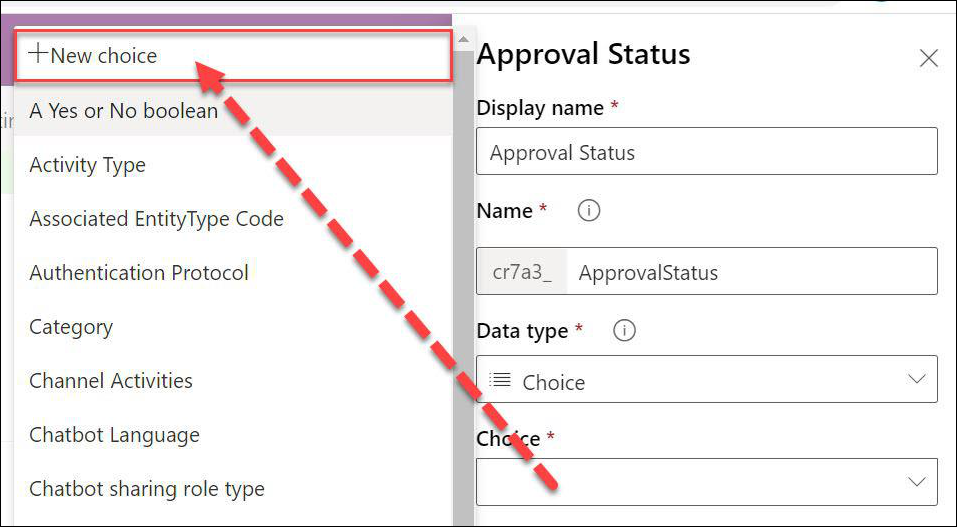
 
9. Change the **New Choice** label to **Approve**

10. Click **Add new item**.

    

11. Enter **Reject** and click **Save**.

    

12. Click **Done**.

    

13. Click **Save Table**.

    

### Task 3: Create a calculated column

In this task, you will add a Department Contribution column and set its value to 10% of the price. In our scenario, this is
the amount that will come from the department manager’s budget. Calculated columns are special columns that
automatically perform the calculation when the data is retrieved. When you create or modify a calculated column you set
the formula used in the calculation.

1. In the upper left corner of the screen, click on **Add Column** to add columns to your custom table.

2. Enter **Department Contribution** for **Display Name** , **Currency** for **Data Type** , click **Add Calculated or Rollup** ,
    and select **Calculation**.

   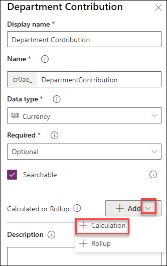

3. Click **Save**.

   

4. If you have not yet allowed popups from Power Apps, you will be prompted to do so now.

   

5. Click **Add Action**.

   

6. Type price and select the **Price** column you created.

   

7. Add *** 0 .1** and click the **Check Mark** button.

  

8. Click **Save and Close.**

   

9. Click **Done**.

Note on currency columns: You might notice that there are two Department Contribution columns one with
(base) next to it. Currency columns in Microsoft Dataverse store the base currency value (this is the configured
default currency for the environment) and the transaction currency (this can be selected on a Row by Row basis)
to allow support for multi-currency transactions. Generally, you will want to make sure to pick the column without
the (base) in the name. The (base) value is commonly used in reporting where you want to normalize multiple
currencies to allow reporting on them in the base currency value.

   

### Task 4: Create a business rule

In this task, you will create a **Business rule** that will set the Estimated Delivery Date to 14 days after approval of the order.

1. Select the **Business rules** tab and click **Add business rule.**

   

2. Click the arrow to **Show Details**.

   

3. Change the **Name** to **Calculate Ship Date** and click the arrow to **Hide Details**.

   

4. Select the **Condition** , change the name to **Check Ship Date**.

   

5. In the **Rule 1** section select **Entity** for **Source** , **Approved Date** for **Column** , **Contains Data** for **Operator** and click
    **Apply**.

**_Note:_** _You may need to scroll down to the bottom of all scroll bars to see the Apply button. You must click Apply after any
change to the properties otherwise they will revert to the prior value. The Business Rule (Text View) will automatically update
after you hit apply when you are done modifying the rule._

    

6. Click **Add** , select **Add Set Field Value**.

   

7. Select the True side of the condition.

   

8. Enter **Set Estimated Ship Date** for **Display Name** , select **Estimated Ship Date** for **Column** , **Formula** for **Type** ,
    **Approved Date** for **Column** , **+** for **Operator** , **Value** for **Type** , **14** for **Days** , and click **Apply**.

    

9. Click **Validate**.

   

10. Make sure validation succeeds.

    

11. Click **Save**.

    

12. Click **Activate**.

    

13. Confirm activation. Business rules only execute when they are activated. In the future to make changes to rules
    you deactivate them, make the change, and then re-activate the rule.

    

14. Close the process editor browser window or tab.

15. Click **Done**. The list should refresh showing the Business Rule you just created.

    

16. Your Device Order table will have one Business Rule.

    
 
## Exercise 3: Connect the data from the Canvas App

Now that you have created the table to store device order requests let’s connect your Device Ordering Canvas app to this
table and add a form to submit device approval requests.

### Task 1: Add Microsoft Dataverse table as a data source to the app

Open the device ordering app. Make sure you are opening the version of the app that is in the newly created environment
that has the Microsoft Dataverse database instance.

1. Select **Apps** , select the **Device Order App** you created in Module 1, and click **Edit.**

   

2. Select the **Data sources** to display the current sources. Select **Add Data.**

   

3. Click on **Device Orders** from the table list to include it as a data source for our app.

   

### Task 2: Create the edit form

1. Switch to the **Tree view** and select the **Main Screen**.

   

2. Select few devices. Hold the “Alt” key, and then it will allow you to check the compare on the devices.

   

3. Select the **Compare Screen**. You should now have the selected devices.

   

4. Select the **Insert** tab, click **Forms** , and select **Edit**.

   

5. Click the **Data Source** drop-down in the Data pane on the right.

   

6. Select the **Device Orders** table as the data source.
 
   

7. Click **Edit Fields**.

   

8. Add, remove, and order fields like the list below. The fields are added using the plus sign and can be reordered by
dragging the field to the desired placement.
    a. Device Name
    b. Price
    c. Approver
    d. Comments
    e. Requested By
    f. Request Date

   

9. Close the **Fields** pane.

10. Move the form control **Form1** to the right of the screen and resize it using the drag handles such that it fits in the
    empty space. See picture on the right. Make sure there is enough space below the form to add a Submit button.

   

**Note** : You can always select controls, such as the Form1 control, from the tree view on the left to make sure you are
selecting the correct control. To move it make sure you select the Form and not a control within the form.

11. Change the **Snap to columns** setting from 3 to 1. This will modify the layout of the edit form to be single
    column.

    

_For more info on working with multi-column form layouts, see [Working with forms layout](https://powerapps.microsoft.com/tutorials/working-with-form-layout/)._

12. To create a new instance of the form when the screen is loaded. Click **Compare Screen** in left tree view pane.

    

13. Select the **OnVisible** property of the screen, enter: **NewForm(Form1)**

    

### Task 3: Configure the title column

In the next few steps, you will configure each of the form Fields.

Let’s start by configuring the Title to display the manufacturer and device name for the selected device. For example, if the
user selects the Surface Pro device, we want the device order to have the title: “Microsoft – Surface Pro”.

1. Expand the **Device Name**.

   

Notice that the default card contains a few controls:

StarVisible1 : This is a label control that has an asterisk (*) which has its Visible property set to true or false depending
on whether the Field is Required or not. Since the Title Field was marked as Required when you configured the table,
its Required property is set to true.
ErrorMessage1 : This is a label that is just below the main data entry Field which displays error messages.
DataCardValue1 : This is the text input control where you can enter the Title. For this scenario, we will set the title
based on the selected device.
DataCardKey1 : This is the label that displays the title of the Field.

    

2. Select **Device Name DataCardValue** in the tree view. Then, open the **Advanced** tab in the right-hand pane.

   

3. Click **Unlock** so you can customize the card

   

_For the next few steps, we will use the Advanced pane to customize control properties within the form, note that you can
perform the same customizations using the property drop-down and formula bar in the top left of the studio._

4. Go to the **Data** section and set the **Default** property to

'Compare List Gallery'.Selected.ManufacturerName & " - " & 'Compare List Gallery'.Selected.'Device Name'

   

5. Change the **DisplayMode** to **DisplayMode.View.** This will prevent users from changing the value within the text
    box.

   

### Task 4: Configure the price Field

In this task, we are going to set the price to the price of the item and then make it read-only.

1. Expand **Price** data card.
 
   

2. Select the **Data Card Value**.
  
   

3. Select the **Advanced** tab and click **Unlock**.

   

4. Change the **Default** property in the Data section to: Text('Compare List
    Gallery'.Selected.Price,"$##,###.00")

   

5. Select the Price Field and change the **DisplayMode** property to DisplayMode.View.

   

### Task 5: Configure the Approval Field

Let’s set the **default** value for the Approver to be the email address of the **logged in user’s manager**.

You will use the **Office 365 graph** to retrieve the manager’s email. You can find more about the Office 365 Users
Connection provider here [Office 365 Users Connection Provider](https://docs.microsoft.com/connectors/office365users/)

1. Select **Data sources**. Click **Add data** , then expand Connectors. Select **Office 365 Users**.

   

2. When prompted, click **Connect**
   
   

3. Select the **Approver Data Card** from the Tree view.
   
   

4. Go to the **Advanced** pane and **Unlock**.

   

5. Set the **Default** value to: User().Email This expression will use your user’s email, so you won’t accidentally e-
    mail your manager to approve your testing.

In a real application or if you wanted to try the expression to use your managers email would be
Office365Users.Manager(User().Email).Mail This would make an API call at runtime to get the manager’s
email address of the logged-on user. If you try this and hit an error when calling the Office365Users.Manager()
function, this may be because a manager is not set up in the system for the logged in Office 365 user. In that case,
you can simply go back go User().Email.

6. Save your work and return to the continue editing the app.

The Office 365 User connector has access to many other valuable types of information you can learn more about
the other actions and data available here [Office 365 users Connector](https://docs.microsoft.com/en-us/connectors/office365users/)

### Task 6: Configure the Comment Field

1. Expand the **Comments** Field and select the **DataCardValue**

2. Set its **HintText** property to: “Enter justification.”

   

### Task 7: Configure the Requested By Field

Let’s set the Requested By Field to be the current logged on user’s email and disable the control so the user cannot
change this value.

1. Expand the **Requested By** card.

2. Select the **DataCardValue.**

3. Go to the **Advanced** pane and **Unlock** the card.

4. Change the **DisplayMode** property to: DisplayMode.View

   

5. Set the **Default** value to User().Email
    This is the email of the currently logged in user

   

### Task 8: Configure the requested date Field

Let’s set the Request Date to be today’s date.

1. Expand the **Request Date** card.

2. Select the **DateValue** card.

   

3. Go to the **Advanced** pane and **Unlock** the card.

4. Change the **DefaultDate** property to Today()

   

Notice that the date in the calendar control will change to today’s date.
Now we will hide the Request Date card. We don’t need to show this Field to the user. Since we have included it as part of
the form the Field will get updated as part of the form submit.

5. Select the **Request Date DataCard**

   

6. Go to the **Properties** pane.

7. Set the **Visible** toggle to **Off**.

   

### Task 9: Add a button to submit the form

1. Select the **MainScreen**.

2. Copy (Ctrl-C) the **Compare button** from the first screen which has the correct color values.

   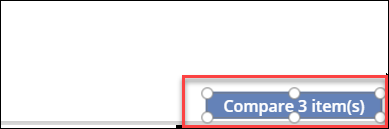

3. Go back to the **Compare Screen** and paste (Ctrl-V) the button.

   

4. Position it in the bottom right of the screen, center aligned with the Form.

5. Make sure the button is larger – you can resize to 280x60 using the Properties pane on the right.

   

6. Set the button’s **Text** property to **“Submit device request”**
   
   
   
7. Rename the button to **Submit Button**.

   

8. The button should be enabled only if a device is selected. To do this, change the button’s **DisplayMode** property
    to: If(!IsBlank('Compare List Gallery'.Selected), DisplayMode.Edit, DisplayMode.Disabled)
   
   
   
Note: You might notice the exclamation mark (!) in the formula !IsBlank() Normally if you just have IsBlank() the
check is for blank. Adding the exclamation mark (!) in front of it changes it to check if it is NOT blank.

9. Next, we are going to configure what we want to happen when the button is clicked. Set the **OnSelect** property
    to SubmitForm(Form1).

   

When the button is pressed, the form data will be submitted to the Microsoft Dataverse.

10. Save your work and return to continue editing the app.

### Task 10: Test the form

1. Select the **Main Screen** in the left side tree navigation and click Play.

   

2. Select a few devices to compare. And click **Compare**.

   

3. Select one of the devices.

   

Notice that the Title, Price, Approver, and Requested By Fields are already filled in.

4. Change the Approver email to your own email for test purposes.
5. Add some **Comments** , such as: “Current laptop does not work, need a new device.”
6. Click **Submit device request.**

   

The button should turn disabled (gray) for a few seconds while it’s submitting the request. If it does not do this
there is likely an error. Click the X in top right to get back to the design mode.
If there is an error, you will see a yellow error icon next to the Submit button, hover over it to check the error.

7. Exit the preview mode (‘X’ in top right).

8. Save the Application and Publish

   

### Task 11: Verify a new item was added to the Device Order table

1. Open a browser window, go to [Make Power Apps](http://make.powerapps.com/).

2. Click on **Dataverse** - > **Tables**.

3. Select the **Device Order** table.

    

4. Select the **Data** tab.

5. You should see a newly added row with your device order details. This may take a few seconds to load.

   

### Task 12: [Optional] Navigate to confirmation screen after the Form submit is successful

This step is optional, if you’re short on time you may skip it and continue to the next module.

Once the Form has been successfully submitted, it’s a good idea to show a confirmation screen and allow the user to
navigate back to the main screen.

1. Navigate to the Canvas Studio for your powerapp.

2. Select **Home** - > **New screen** - > **Blank**

   

3. Rename the screen to **Submit Success Screen** 
  
   
  
4. Expand the **Compare Screen**.

5. Select the Form – you can use the tree view on the left to select **Form1**.

   

6. Set the **OnSuccess** property to: Navigate('Submit Success Screen', ScreenTransition.None)

    

7. Copy (Ctrl-C) the **Header** from the Compare Screen.

8. Go to the to the **Submit Success Screen** , paste the header and align Top.

   

9. **Insert** another **label** in the middle of the screen and set the **Text** to: **"Your device request has been successfully**
    **submitted. Thank you."**

10. Increase the font size, the size of the label and center the text.

    

11. Add a **button** and set its **Text** to: **"OK”.**

12. When pressed, the button should remove items from the CompareList collection and navigate to the main screen.

13. Set the **OnSelect** property of the button to:

Clear(CompareList);Navigate('Main Screen',ScreenTransition.None)

    

**Note** : ‘;’ is used a separator when multiple functions are called one after the other. If you are in a locale where ‘;’ is used as
a comma-separator, then use a double ‘;’ here (without the single-quotes).

14. Move the label up and add a Display Form: **Insert** - > **Form** - > **Display.**

    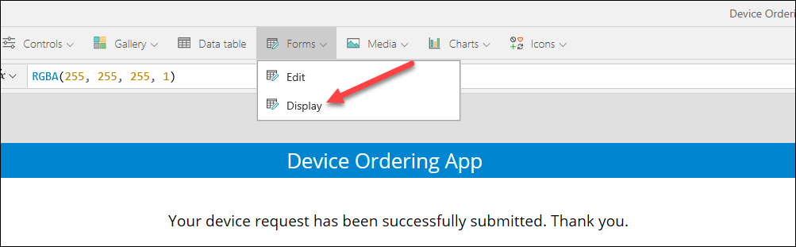

15. Configure its **data source** to point to the **‘Device Orders’** table.

    

16. Select the Fields to display: Device Name, Price, Comments, Approver, Requested By, Request Date. Rearrange and
    remove any additional Fields.
   
   

17. Change the **Snap to column** value from 3 to 1.

    

18. Change the **Layout** from Vertical to **Horizontal**.

    

19. Set form **Item** property to Form1.LastSubmit

    

20. Reposition/Resize the form until it looks like the image below. The Label will be first on the screen, centered under
    the header. Then, position the view form to be centered under the label. Finally, the “OK” button will be should be
    centered at the bottom of the page under the view form.

   

21. Save your changes and **Publish**.

22. Select the **Main Screen** and click **Play**.

23. Select few more devices and click Compare

    

24. Select one of the new devices, provide a comment and click Submit.

    

25. Verify that the confirmation screen shows the order details. Click **OK**.

    

26. The application will navigate back to the main screen and the compare list will be cleared.

    

27. Close the application.

