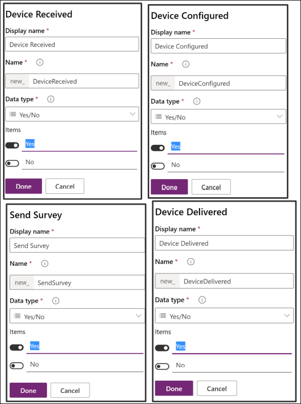

# Power Platform

# App in a Day

Module 3 : Power Apps Model-driven App

### Hands-on Lab Step-by-Step

## Contents

- Power Apps Model-driven App
   - Lab Prerequisites
   - Exercise 1: Create Application and add Columns to the Device Order Table
   - Exercise 2: Business Process Flow
   - Exercise 3: Form and View Modification
   - Exercise 4: Test the application

## Power Apps Model-driven App

### Lab Prerequisites

This is the third lab in a four-part series covering Power Apps canvas apps, Microsoft Dataverse, Power Apps model-driven
apps, and Power Automate. The assumption is that you have successfully completed the first two modules, or at least the
initial part of setting up an environment as described in the overview – **(Page 1 of lab guide)** .

If you have not completed the previous two modules, you can use the partially completed version of the lab package in
the **C:\PowerApps-in-a-day\Completed\Module2** folder. Follow the instructions in the document **Importing Module 2 Completed** before
proceeding with this module, which will provision the app, and the Microsoft Dataverse Table into your environment.

### Model-driven Apps – A brief introduction

The model-driven apps are built by composing multiple page types and components using several focused designers.
Additionally, there are designers for the Table and business logic. The page types come from the View Designer, Form
Designer, and Dashboard Designer. Visual components include the Sitemap Designer and Business Process Flow Designer.
The App Designer then composes the app by identifying the UI elements to show. The multiple designers allow rich
targeted definition of different parts of the app and its behavior.

- App Designer specifies the sitemap, global dashboards, business processes flows, and Table forms, views, and
    dashboards. You can find more refernces here: `https://docs.microsoft.com/en-us/dynamics365/customer-engagement/customize/design-custom-business-apps-using-app-designer`
- Sitemap Designer provides the application navigation that is always available. You can find more refernces here: `https://docs.microsoft.com/en-us/dynamics365/customer-engagement/customize/create-site-map-app`
- Business Process Designer provides stages and steps to guide users consistently through common business
    processes within a form. You can find more refernces here: `https://docs.microsoft.com/en-us/dynamics365/customer-engagement/customize/business-process-flows-overview`
- Table Designer defines the Columns, relationships, and metadata for a Table. You can find more refernces here: `https://docs.microsoft.com/en-us/powerapps/maker/common-data-service/data-platform-intro`
- Business Rule Designer provides no-low business logic for a Table. You can find more refernces here: `https://docs.microsoft.com/en-us/powerapps/maker/common-data-service/data-platform-create-business-rule`
- View Designer specifies Columns and filter conditions for a Row list. You can find more refernces here: `https://docs.microsoft.com/en-us/dynamics365/customer-engagement/customize/create-edit-views`
- Form Designer specifies the Columns and controls along with layout for a single Row. You can find more refernces here: `https://docs.microsoft.com/en-us/dynamics365/customer-engagement/customize/create-design-forms`
- Dashboard Designer summaries one or more Tables using charts, lists, etc. You can find more refernces here: `https://docs.microsoft.com/en-us/dynamics365/customer-engagement/customize/create-edit-dashboards`

The model-driven apps are fully responsive, so a single definition works from web to tablet to mobile devices. This is a
different with the canvas apps which need to choose the Mobile vs. Tablet when defining the app.

### Scenario for building a Model-driven app

In the first lab module, you built a Power Apps Canvas application for an organization where every three years the
employees go through a hardware refresh cycle. The application let employees place a request for a device using the

Power Apps app that you built. In the second lab module, using a custom Table you created in the Microsoft Dataverse
lab, you stored that request for processing.

From the requesting employee's point of view, after they place the order, the new device just magically shows up. But
there is a back-office process that needs to happen to manage the procurement, setup of the device, and distribution of
the device to that requesting employee. In this lab you will be building a Power Apps Model-driven app that will be used
by the two or three back office staff that manage fulfilling device requests. Using the Model-driven app style, you can take
advantage of the Business Process feature of Model-driven apps to keep the back-office staff on track for each device
request.

     
   
**Model-driven apps** are a new style of application you can build directly from PowerApps.com. Model-driven apps make it
easy to build forms over data applications quickly. This style of application brings together forms, views, dashboards and
charts quickly to provide a productive user experience for working with related data. These components can quickly be
customized to show only the data that is relevant for the scenario.

**Table views** : Views are what users see when they look at a list of Rows from the Microsoft Dataverse. Views define the
columns that are visible as well as the criteria for inclusion of the Rows in the display.

**Table forms** : Forms are used when users drill down into a Row from an Table View. Forms are created using a visual drag-
and-drop designer to place Columns into the form that is structured into tabs and sections.

**Business process flows** : These flows are interactive visual guides to help the user through a business process. Business
process flows use the concept of stages that contain steps. Stages are milestones in the process that need to be
completed and the steps highlight to the user either data to collect or tasks to complete the stage to progress. Flows are
created using a visual designer using drag and drop to compose the flow and establish any branching conditions
(different paths in the business process) that must be handled.

For more details on Model-driven apps and the differences between Canvas apps and Model-driven apps, you can see the product announcement here: `https://powerapps.microsoft.com/blog/powerapps-spring-announce/`


## Exercise 1: Create Application and add Columns to the Device Order Table

In this exercise, you will be creating a standalone Model-driven application that will leverage the same Device Request
Table you created in the Microsoft Dataverse in Lab 2.

### Task 1: Create an application

The first thing you will do is create a Model-driven application. This application will serve as a container to identify all the
components that make up the application. It also will include a sitemap that defines the custom navigation users will use
to navigate between the components (Table views, Dashboards and other visual components).

1. Navigate to Power Apps Portal using the below URL if not already and select the environment that you created earlier.
  
  ```
   https://make.powerapps.com/
   ```
1. Select **Home** and click **+ Blank app**.

     
   
1. Click on the **Create** button of the Model-driven app section.

     
   
1. Select the Classic app designer and click **Create**.

     
1. Enter **Device Procurement** for Name and click **Done.** You have now created the app definition and will start
    adding components in to build the app.
    
     
   

    > Note : When building a real app, you would also upload an image to be used as the App Tile. The App Tile is seen by
the user in the list of all their applications.

     Next, you will build a Site Map for the application, the completed Site Map will look like the image below.

     
1. Click **Edit Site Map**. This will launch the designer that will let you modify the App navigation.

     
   
1. Select the **New Area** label, in the properties rename it **Back Office** and enter **nav_backoffice** for ID**.** If you were
    building a more complex application, you could use Areas to group together related items making it easy for the
    user to navigate between the components.
    
     

   > Note: The properties panel on the right will only show if you click on the New Area on the left.

1. Select the **New Group** enter **Orders** for Title, and **nav_ordersgroup** for ID.

     
   
   > Note: The properties panel on the right will only show if you click on the New Group on the left.
   
1. Select the **New Subarea**.

     

   > Note: The properties panel on the right will only show if you click on the New Subarea on the left.

1. Set the **Entity** for **Type** , select **Device Order** for **Table** , enter **Device Orders** for **Title** and enter
    **nav_device_orders** for **ID**.
    
     
   
1. Click **Save and Close.**

     

1. Click **Save** again, this time in the App Designer.

     
   
1. **Publish** the application.

     
   
1. Click **Save and Close**.

### Task 2: Add procurement columns to the Device Orders

In this task, you will add new Columns to the Device Order table. The Columns you are going to add here are Columns
that support the Business Process Flow, which we are going to build in the next exercise. When you use a Business
Process, it consists of Stages which you can think of as major milestones in completing the work. Each Stage has one or
more Steps. Steps help users keep track of what they need to do before advancing to the next Stage. Steps are just
Columns on the Table. To make it quicker when we create the Business Process in this task, we are going to first create
the Columns that we need.

To support our scenario, we are going to add the following Columns to the Table:

**Capital Approved** : This Column will be used in the flow to capture that the device order has received capital approval.

**Send Survey** : This Column will be used in the final stage. Right now, the team plans on manually sending a survey to see
how the user’s ordering experience was, and will manually check this once they send it, but they have a desire in a future
update to automate sending a survey in a future release.

1. Navigate to to Power Apps Portal using the below URL  if not already.

   ```
   https://make.powerapps.com/
   ```
1. Expand **Dataverse** , select **Tables** , search for **Device Order** and click on it.

     
   
  
1. Make sure you have the **Columns** tab selected and click **Add Column**.

     
   
1. Enter **Capital Approved** for **Display Name** , select **Yes/No** for **Data Type** and click **Done**. We are using a Yes/No
    data type here because when we use it as a Step in the Business Process, we want to be able to simply mark it
    completed. Yes/No are essentially a true or false Column.
    
     
1. Create 4 more **Yes/No** Columns and name them **Device Received, Device Configured, Send Survey** , and
    **Device Delivered**.

     

6. Add another Column, with the name **Supplier Order ID** , select **Text** for **Data Type** and click **Done**. Notice
    we are not asking you to make this Column required here, but we will make it a required Column in the
    Business Process later in the lab.

     


7. Click **Save Table**.

     

## Exercise 2: Business Process Flow

In this exercise, we are going to add a Business Process Flow to the Device Order to help guide the back-office worker
through the task of managing the procurement of the requested device.

In discovery meetings with the back-office workers, we learned that a device request goes through the following tasks as
they perform the magic to get the requestor their device.

- **Device Requested** – Today this is an e-mail sent to them with the device request. Going forward in the new
    Power Apps world this will be a Device Order Row in the Microsoft Dataverse.
- **Place Order** – Once they receive the request, they will place an order with a supplier and get an order ID.
- **Receive Device** – This occurs when the device is received, and they send it to the IT staff to be configured with
    the standard software.
- **Distribute Device** – Once configured it needs to get to the employee that requested it, and they need to survey
    the employee to make sure they are happy.

Each of these represents a milestone and will become our Stages in the Business Process Flow. In a more complex
scenario, you would likely end up compressing or even possibly re-imagining the business process to make it more
optimal than the current process the staff performs with their existing process.

For this lab, the _Receive Device and Distribute Device stages are marked optional_. While these stages would need to be
created for a full implementation of the scenario, to save time you may skip them or do them as a take home exercise.

The completed Business Process Flow will look like the image below.


     


### Task 1: Create business process flow

1. Select **Flows**.

     

1. Select the **Business Process Flow** tab and click **New**.

     

1. Enter **Device Procurement Process** for Flow Name, select **Device Order** for Table, and click **Create**. 
 
     
 
   > Info: When you create the Business Process Flow behind the scenes it creates another Table with the same name as the Business
    Process Flow to track the progress of each business process on the Row. Because of this, choose your name
    carefully, for example, you wouldn’t want to use the same name as your Table e.g. Device Order. Here we choose
    Device Procurement Process. Note: After you click OK, a new window will be loaded with the designer. If you
    have popup blockers enabled this might be blocked. The window might also not immediately have focus and you
    might have to manually bring it into focus.

1. Select the **New Stage** and change the Display Name to **Device Requested** and click **Apply**.

     

1. Click **Details.**

     

1. Select the **Data Step** , select **Request Date** for Data Field and click **Apply**. The Step Name will auto-filled for you.

     

1. Click **Add** and select **Add Data Step**.

     

1. Click on the **small +** under Data Step #1.

     

1. Select **Approval Status** for Data Field and click **Apply**.

     

1. Add another Data Step, select **Price** for Data Field and click **Apply**.

     

1. Select the **Components** tab.

     

1. Drag **Stage** to the canvas and place to the right of the **Device Requested** stage.

     

1. Select the new stage, change the Display Name to **Place Order** and click **Apply**.

     

1. Click **Details**.

     

1. Select the existing Data Step, select **Estimated Ship Date** for Data Field, and click **Apply**.

     

1. Select the **Components** tab, drag **Data Step** to the canvas and place is under the **Estimated Ship Date** step.

     


17. Select **Supplier Order ID** for Data Column, check the **Required** field and click **Apply**. Remember from before this
    Column isn’t required, but by checking this here, we will require it to be filled out before they can advance to the
    next stage. It won’t, however, block saving the Row if there isn’t a data value populated like it would if it was
    marked required on the Column definition.
    
      

    > **NOTE: All steps from here onwards until you reach Task 2 are OPTIONAL. These steps add two more stages to the
business process using the same technique you learned above. You may skip ahead to Task 2 to add a branch
condition.**

1. Select the **Components** tab and drag **Stage** to the right side of the **Place Order** stage.

     

1. Select the new stage, change the Display name to **Receive Device** and click **Apply**.

     

1. Click **Details**.
1. Select the existing Data Step and select **Device Received** for Data Column and click **Apply**.

     

1. Select the **Components** tab, drag **Data Step** to the **Receive Device** stage and place it under the **Device Received**
    step.

     

1. Select **Device Configured** for Data Column and click **Apply**.

     

1. Add another stage and name it **Distribute Device**.
1. Add two data steps **Device Delivered** and **Send Survey**.

     

### Task 2: Add a branch condition

In this task, we are going to add a conditional branch to our Business Process Flow. When we did the discovery, we
learned that if the price was greater than $1K there were additional steps in place to get capital approval prior to placing
the order. In this task, you will see how we can modify the flow we built to accommodate this.

1. Select the **Components** tab, drag **Condition** and place it between **Device Requested** and **Place Order**.

     

1. Select the **Condition** and change the Display Name to **Check Price.**

     

1. In the **Rule 1** section, select **Price** for Column, **is greater than** for Operator, **Value** for Type, **1000** for Value, and
    click **Apply**. It’s important to note that Columns you use in the rules on the condition must be in the prior Stages
    steps. That is one of the reasons we put the price in there previously.
    
     
    
1. Click **Save**.

     

1. A new stage will be added.

     
   
1. Select the new stage, change the Display Name to **Capital Approval** and click **Apply**.

     
   
1. Click **Details**.

     
   
1. Select the existing Data Step, select **Capital Approved** for Data Column and click **Apply**.

     
   
1. Click **Save**.

     
   
1. Click **Activate**.

     
   
1. Confirm the activation.

     

1. Close the process editor.
1. Click on the  **Back** button.
1. **Publish All Customizations**.

     
   
## Exercise 3: Form and View Modification

In this exercise, we are going to modify the Device Order form to add additional Columns. When you create an Table in
the Microsoft Dataverse, it also creates a main Form for that Table with a few basic Columns on it. In addition to the form,
views are created for the Table. Views are used in a Model-Driven app any time a list of the Table Rows are displayed. You
would modify the view to add additional Columns or change the placement. You can also create additional views, for
example, you might provide a view to show all device requests that are waiting to be received.

### Task 1: Modify the form

1. Expand **Dataverse** , select **Tables**. Search for **Device Order** Table and click to open.

     
   
1. Select the **Forms** tab.

1. Select the **Information Main** form and click **Edit Form** > **Edit form in new tab.**

     
   
   > Note: The form designer is being modernized, you can read more here Overview of the model-driven form
designer.

1. If you are required to sign in again, do so.
1. Search for **Approver** Column and drag it to the form.

1. Place the **Approver** Column above the Device Name Column.

     
   
1. The new form designer will let you reposition Columns. Drag the **Approver** Column and place it between the
    Device Name and Owner Columns.
    
     
   
1. The new form designer will let you cut and paste Columns. Select the **Approver** Column and click on the **Cut**
    button.

     
   
   
1. Select the **Owner** Column and click **Paste**.

     
   
1. The **Approval** Column will be moved to the bottom.

     
   
1. Click **Save**.

     

1. Click **Publish**.

     
   
1. Close the **Form Designer** tab.


### Task 2: Modify the view

1. Select the **Views** tab and click on the **Active Device Orders** view to open it.

     
1. Click the **Approval Status** Column once (you do not need to double click).

     
   
1. The new column will be added to the view.

     

1. Click on the **+ View Column** button.

     
   
1. Select **Estimated Ship Date.**

     
   
1. Add **Price** and **Status** to the View.

     
   
1. Click **Save.**

     

1. **Publish** the View.

     

1. Click on the back button.

     

### Exercise 4: Test the application

In this exercise, we are going to test the application you just built.

### Task 1: Test the application

1. Select **Apps** , select the Device Procurement application and click **Play**.

     

1. The application should start. The **Active Device Orders** view should load.
    > **Note: If you don’t show any data in the list, run the Device Ordering canvas app you built and submit some orders.**

        
1. Start a new web browser instance and navigate to Make Power Apps. Do not close the Model-driven application.
1. Select **Apps** , select the Device Ordering application you created in module 2, and click **Play**.

     
1. Select two devices, make sure one of the devices is priced over $1,000 and click **Compare**.
   > Note: If you are using a Chrome browser, the Manufacturer logos may not load correctly._

     
1. Select the device with the price over $1k and click **Submit**.

     
1. Click **OK**. Note that if you did not choose to create the submission success screen in a previous module that this
    option will not exist. You will need complete steps 3 and 4 (above) in order to continue.
    
         
1. Select two more devices and click Compare.

     

1. Select a device with a price under $1k, provide approver email (or leave in the auto-populated manager email)
    and click **Submit**.
    
         
1. Go back to the Model-driven application you created and refresh the view. Sort the orders by **Created On** column,
    and you should see the two devices you ordered using the Power Apps Canvas App.
    
         
11. Open the one priced over $1k.
12. The **Business Process Flow** should now have **5** stages. This is because this order costs more than $1k and needs
**Capital Approval**.

      

1. Select **Device Orders**.
1. Click on the other order you created.
1. The **Business Process Flow** for this order should have **4** stages; this is because this order does not require **Capital**
    **Approval**.

     

