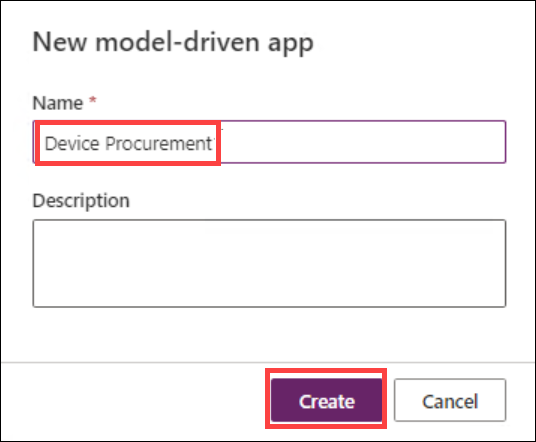
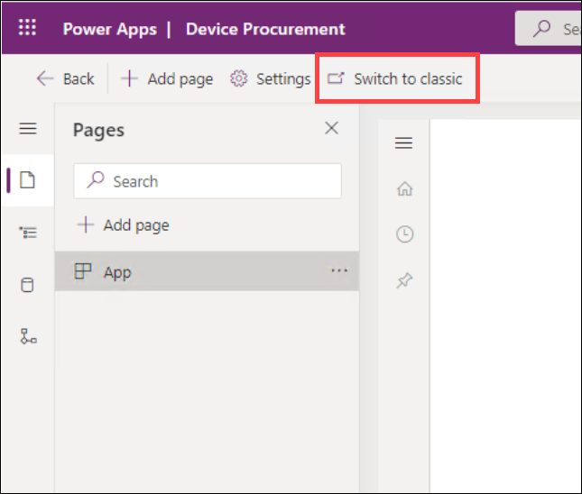
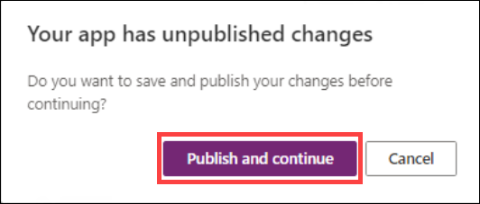
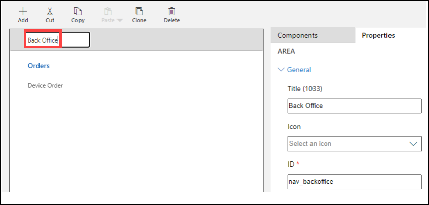
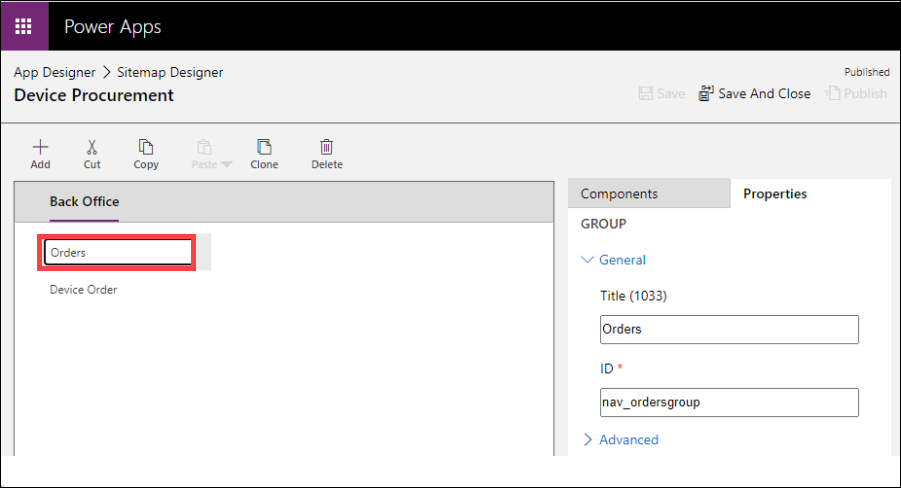
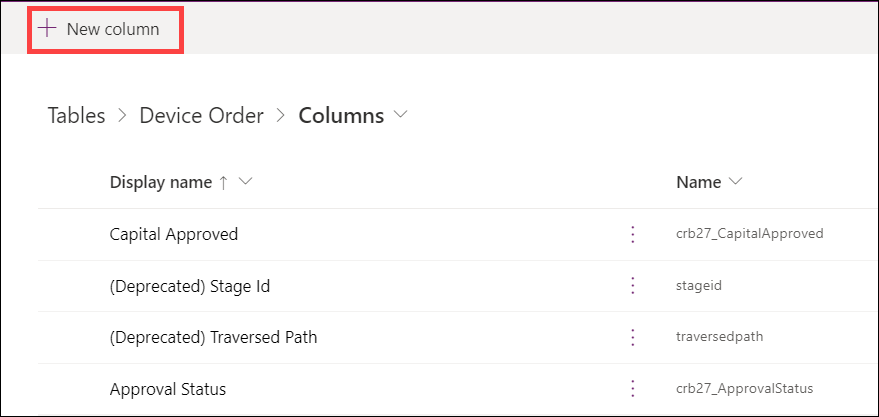
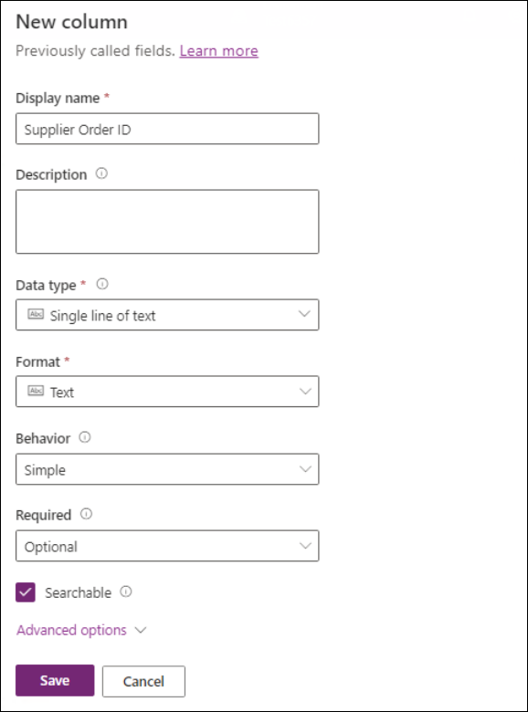
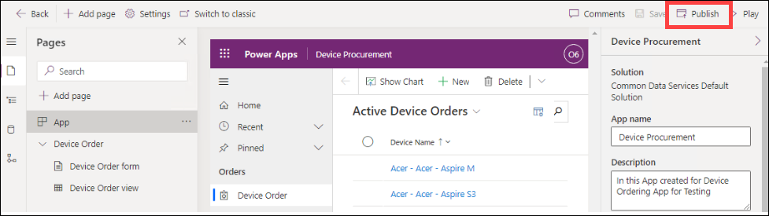
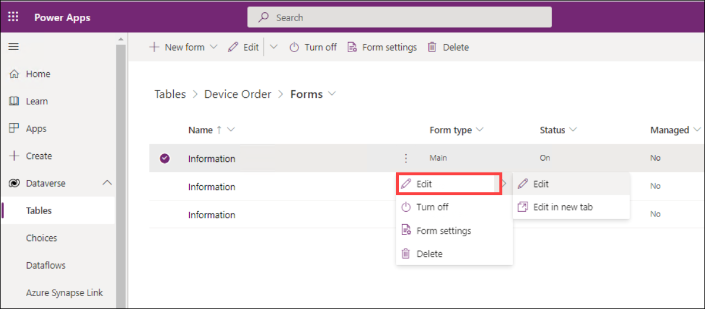
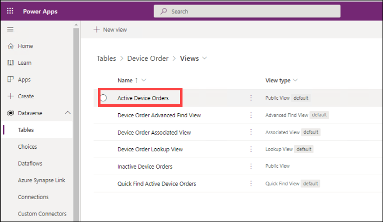

# Module 3 : Power Apps Model-driven App

### Estimated Duration: 120 minutes

## Overview

In this lab, you will explore the process of building model-driven apps by leveraging various focused designers to create a robust and user-friendly application. Key activities include using the View Designer, Form Designer, and Dashboard Designer to define page types; employing the Sitemap Designer and Business Process Flow Designer for visual components and workflows; and utilizing the Table Designer for data modeling and logic. Finally, you will use the App Designer to compose the app, integrating UI elements to craft a seamless user experience. This hands-on exercise demonstrates how these tools collectively enable the creation of rich, targeted app solutions.

## Lab objectives

In this lab, you will complete the following tasks:

- Exercise 1: Create Application and add Columns to the Device Order Table
- Exercise 2: Business Process Flow
- Exercise 3: Form and View Modification
- Exercise 4: Test the application

## Exercise 1: Create Application and add Columns to the Device Order Table

In this exercise, you will be creating a standalone Model-driven application that will leverage the same Device Request
Table you created in the Microsoft Dataverse in Lab 2.

### Task 1: Create an application

1. Navigate to Power Apps Portal using the below URL if not already and select the environment that you created earlier.
  
  ```
   https://make.powerapps.com/
   ```
1. In the **Home** page, search for model and select **Model-driven app from blank**.

     
   
1. Enter the below value for **Name** and click **Create**. You have now created the app definition and will start
    adding components in to build the app.

   ```
   Device Procurement
   ```
   
     
   
1. Click the **Switch to classic** button to switch to the classic designer of the app. 
    
        
   
1. Click on **Publish and continue** then **Save** to save the app. The classic designer of the app will be opened in a new browser tab.   

     
   
1. Click **Edit Site Map**. This will launch the designer that will let you modify the App navigation.

     
   
1. Select the **New Area** label, in the properties rename it **Back Office** and enter **nav_backoffice** for **ID** If you were
    building a more complex application, you could use Areas to group together related items making it easy for the
    user to navigate between the components.
    
     

   > Note: The properties panel on the right will only show if you click on the New Area on the left.

1. Select the **New Group** enter **Orders** for Title, and **nav_ordersgroup** for ID.

     
   
   > Note: The properties panel on the right will only show if you click on the New Group on the left.
   
1. Select the **New Subarea**.

   > Note: The properties panel on the right will only show if you click on the New Subarea on the left.

1. Set the **Entity** for **Type** , select **Device Order** for **Entity** , enter **Device Orders** for **Title** and enter
    **nav_device_orders** for **ID**.
    
     
   
1. Click **Save and Close.**

     

1. Click **Save** again, this time in the App Designer.

     
   
1. **Publish** the application.

     
   
1. Click **Save and Close**.

### Task 2: Add procurement columns to the Device Orders

1. Navigate to to Power Apps Portal using the below URL  if not already.

   ```
   https://make.powerapps.com/
   ```
1. Select **Tables**, select **Device Order** and click on it.

     
   
  
1. Click on **Columns** under **Schema**, to select the **Columns** tab and click on **+ New Column**.

     
   
1. Enter **Capital Approved** for **Display Name** , select **Yes/No** for **Data Type** and click **Save**. We are using a Yes/No
    data type here because when we use it as a Step in the Business Process, we want to be able to simply mark it
    completed. Yes/No are essentially a true or false Column.
    
     
   
1. Create 4 more **Yes/No** Columns and name them **Device Received, Device Configured, Send Survey** , and
    **Device Delivered**. 
   
6. Add another Column, with the name **Supplier Order ID** , select **Text** for **Data Type** and click **Save**. Notice
    we are not asking you to make this Column required here, but we will make it a required Column in the
    Business Process later in the lab.

     
 

## Exercise 2: Business Process Flow

In this exercise, we are going to add a Business Process Flow to the Device Order to help guide the back-office worker
through the task of managing the procurement of the requested device.

In discovery meetings with the back-office workers, we learned that a device request goes through the following tasks as
they perform the magic to get the requestor their device.

- **Device Requested** – Today this is an e-mail sent to them with the device request. Going forward in the new
    Power Apps world this will be a Device Order Row in the Microsoft Dataverse.
- **Place Order** – Once they receive the request, they will place an order with a supplier and get an order ID.
- **Receive Device** – This occurs when the device is received, and they send it to the IT staff to be configured with
    the standard software.
- **Distribute Device** – Once configured it needs to get to the employee that requested it, and they need to survey
    the employee to make sure they are happy.

Each of these represents a milestone and will become our Stages in the Business Process Flow. In a more complex
scenario, you would likely end up compressing or even possibly re-imagining the business process to make it more
optimal than the current process the staff performs with their existing process.

For this lab, the _Receive Device and Distribute Device stages are marked optional_. While these stages would need to be
created for a full implementation of the scenario, to save time you may skip them or do them as a take home exercise.

The completed Business Process Flow will look like the image below.


     


### Task 1: Create business process flow

1. Select **Solutions** from the left navigation pane and click on **Default Solution**.


1. Click on New > Automation > Process > **Business Process Flow** tab and click **New**.

     

1. Enter **Device Procurement Process** for Flow Name, select **Device Order** for Table, and click on **Create**. 
 
     
 
   > Info: When you create the Business Process Flow behind the scenes it creates another Table with the same name as the Business
    Process Flow to track the progress of each business process on the Row. Because of this, choose your name
    carefully, for example, you wouldn’t want to use the same name as your Table e.g. Device Order. Here we choose
    Device Procurement Process. Note: After you click OK, a new window will be loaded with the designer. If you
    have popup blockers enabled this might be blocked. The window might also not immediately have focus and you
    might have to manually bring it into focus.

1. Select the **New Stage** and change the Display Name to **Device Requested** and click **Apply**.

     

1. Click **Details.**

     

1. Select the **Data Step** , select **Request Date** for Data Field and click **Apply**. The Step Name will auto-filled for you.

     

1. Click **Add** and select **Add Data Step**.

     

1. Click on the **small +** under Data Step #1.

     

1. Select **Approval Status** for Data Field and click **Apply**.

     

1. Add another Data Step, select **Price** for Data Field and click **Apply**.

     

1. Select the **Components** tab.

     

1. Drag **Stage** to the canvas and place to the right of the **Device Requested** stage.

     

1. Select the new stage, change the Display Name to **Place Order** and click **Apply**.

     

1. Click **Details**.

     

1. Select the existing Data Step, select **Estimated Ship Date** for Data Field, and click **Apply**.

     

1. Select the **Components** tab, drag **Data Step** to the canvas and place is under the **Estimated Ship Date** step.

     


17. Select **Supplier Order ID** for Data Column, check the **Required** field and click **Apply**. Remember from before this
    Column isn’t required, but by checking this here, we will require it to be filled out before they can advance to the
    next stage. It won’t, however, block saving the Row if there isn’t a data value populated like it would if it was
    marked required on the Column definition.
    
      

### Task 2: Add a branch condition

In this task, we are going to add a conditional branch to our Business Process Flow. When we did the discovery, we
learned that if the price was greater than $1K there were additional steps in place to get capital approval prior to placing
the order. In this task, you will see how we can modify the flow we built to accommodate this.

1. Select the **Components** tab, drag **Condition** and place it between **Device Requested** and **Place Order**.

     

1. Select the **Condition** and change the Display Name to **Check Price.**

     

1. In the **Rule 1** section, select **Price** for Field, **is greater than** for Operator, **Value** for Type, **1000** for Value, and
    click **Apply**. It’s important to note that Columns you use in the rules on the condition must be in the prior Stages
    steps. That is one of the reasons we put the price in there previously.
    
     
    
1. Click on **Save**.

1. A new stage will be added.

     
   
1. Select the new stage, change the Display Name to **Capital Approval** and click **Apply**.

     
   
1. Click **Details**.

     
   
1. Select the existing Data Step, select **Capital Approved** for Data Field and click **Apply**.

     
   
1. Click on **Save**.
   
1. Click on **Activate**.

     
   
1. Confirm the activation.

1. Close the process editor.

1. Navigate back to the Device Procurement we created in the first task and click on **Save and Publish** button that is present at the top right corner of the window.

     
   
## Exercise 3: Form and View Modification

In this exercise, we are going to modify the Device Order form to add additional Columns. When you create an Table in
the Microsoft Dataverse, it also creates a main Form for that Table with a few basic Columns on it. In addition to the form,
views are created for the Table. Views are used in a Model-Driven app any time a list of the Table Rows are displayed. You
would modify the view to add additional Columns or change the placement. You can also create additional views, for
example, you might provide a view to show all device requests that are waiting to be received.

### Task 1: Modify the form

1. Select **Tables** from the left navigation pane and select **Device Order** Table.

1. Select the **Forms** that is present under **Data Experiences**.

1. Select the **Information Main** form and click **Edit Form** > **Edit form in new tab.**

     
   
   > Note: The form designer is being modernized, you can read more here Overview of the model-driven form
designer.

1. If you are required to sign in again, do so.
1. Search for **Approver** Column and drag it to the form.

1. Place the **Approver** Column above the Device Name Column.

   
1. The new form designer will let you reposition Columns. Drag the **Approver** Column and place it between the
    Device Name and Owner Columns.
    
     
   
1. The new form designer will let you cut and paste Columns. Select the **Approver** Column and click on the **Cut**
    button.

     
   
   
1. Select the **Owner** Column and click **Paste**.

     
   
1. The **Approval** Column will be moved to the bottom.

     
   
1. Click on **Save and Publish**.
   
1. Close the **Form Designer** tab.


### Task 2: Modify the view

1. Select the **Views** tab under **Data experiences** and click on the **Active Device Orders** view to open it.

     
   
1. Click the **Approval Status** Column once (you do not need to double click).

     
   
1. The new column will be added to the view.

     

1. Click on the **+ View Column** button.

     
   
1. Select **Estimated Ship Date.**

     
   
1. Add **Price** and **Status** to the View.

     
   
1. Click **Save and Publish**.

1. Click on the back button.

     

### Exercise 4: Test the application

In this exercise, we are going to test the application you just built.

### Task 1: Test the application

1. Select **Apps** , select the Device Procurement application and click **Play**.

     

1. The application should start. The **Active Device Orders** view should load.
    > **Note: If you don’t show any data in the list, run the Device Ordering canvas app you built and submit some orders.**

        
1. Start a new web browser instance and navigate to Make Power Apps. Do not close the Model-driven application.
1. Select **Apps** , select the Device Ordering application you created in module 2, and click **Play**.

     
1. Select two devices, make sure one of the devices is priced over $1,000 and click **Compare**.
   > Note: If you are using a Chrome browser, the Manufacturer logos may not load correctly._

     
1. Select the device with the price over $1k and click **Submit**.

     
1. Click **OK**. Note that if you did not choose to create the submission success screen in a previous module that this
    option will not exist. You will need complete steps 3 and 4 (above) in order to continue.
    
         
1. Select two more devices and click Compare.

     

1. Select a device with a price under $1k, provide approver email (or leave in the auto-populated manager email)
    and click **Submit**.
    
         
1. Go back to the Model-driven application you created and refresh the view. Sort the orders by **Created On** column,
    and you should see the two devices you ordered using the Power Apps Canvas App.
    
         
1. Open the one priced over $1k.
1. The **Business Process Flow** should now have **5** stages. This is because this order costs more than $1k and needs **Capital Approval**.

     

1. Select **Device Orders**.
1. Click on the other order you created.
1. The **Business Process Flow** for this order should have **4** stages; this is because this order does not require **Capital**
    **Approval**.

     

