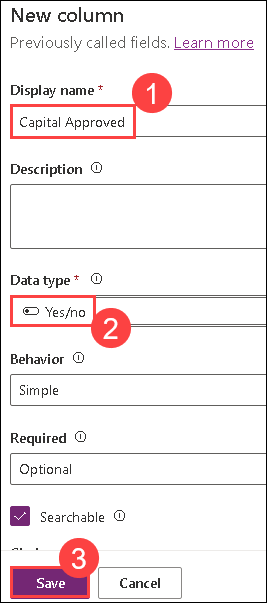
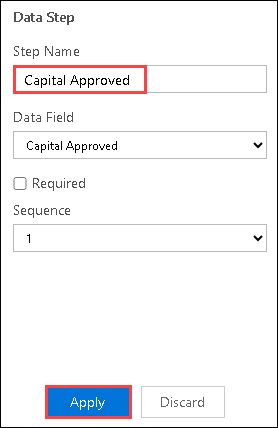
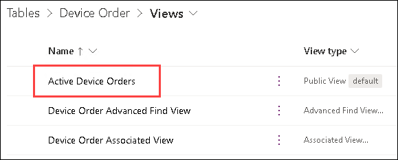

# Module 3 : Power Apps Model-driven App

### Estimated Duration: 120 minutes

## Overview

In this lab, you will explore the process of building model-driven apps by leveraging various focused designers to create a robust and user-friendly application. Key activities include using the View Designer, Form Designer, and Dashboard Designer to define page types; employing the Sitemap Designer and Business Process Flow Designer for visual components and workflows; and utilizing the Table Designer for data modeling and logic. Finally, you will use the App Designer to compose the app, integrating UI elements to craft a seamless user experience. This hands-on exercise demonstrates how these tools collectively enable the creation of rich, targeted app solutions.

## Lab objectives

In this lab, you will complete the following tasks:

- Exercise 1: Create Application and add Columns to the Device Order Table
- Exercise 2: Business Process Flow
- Exercise 3: Form and View Modification
- Exercise 4: Test the application

## Exercise 1: Create Application and add Columns to the Device Order Table

In this exercise, you will be creating a standalone Model-driven application that will leverage the same Device Request
Table you created in the Microsoft Dataverse in Lab 2.

### Task 1: Create an application

1. Navigate to Power Apps Portal using the below URL if not already and select the environment that you created earlier.
  
    ```
     https://make.powerapps.com/
     ```
1. In the **Home** page, search for model and select **Model-driven app from blank**.

      
   
1. Enter the below value for **Name** and click **Create**. You have now created the app definition and will start
    adding components in to build the app.

   ```
   Device Procurement
   ```
   
     
   
1. Click on **New** and select **Web resource**.

      

1. Select **browserPreviewFrame.html** and click on **Add**.

      

1. Click the **Switch to classic** button to switch to the classic designer of the app. 
    
        
   
1. Click on **Publish and Save** to save the app. The classic designer of the app will be opened in a new browser tab.   
   
1. Click on the Edit button next to **Site Map**. This will launch the designer that will let you modify the App navigation.

      
   
1. Select the **New Area** label, in the properties rename it **Back Office** and enter **nav_backoffice** for **ID** If you were
    building a more complex application, you could use Areas to group together related items making it easy for the
    user to navigate between the components.
    
     

   > Note: The properties panel on the right will only show if you click on the New Area on the left.

1. Select the **New Group** enter **Orders** for Title, and **nav_ordersgroup** for ID.

     
   
   > Note: The properties panel on the right will only show if you click on the New Group on the left.
   
1. Select the **New Subarea**.

      

   > Note: The properties panel on the right will only show if you click on the New Subarea on the left.

1. Set the **Entity** for **Type** , select **Device Order** for **Entity** , enter **Device Orders** for **Title** and enter
    **nav_device_orders** for **ID**.
    
     
   
1. Click **Save and Close.**

     

1. Click **Save** again, this time in the App Designer.

     
   
1. **Publish** the application.

     
   
1. Click **Save and Close**.

### Task 2: Add procurement columns to the Device Orders

1. Navigate to to Power Apps Portal using the below URL  if not already.

   ```
   https://make.powerapps.com/
   ```
1. Select **Tables**, select **Device Order** and click on it.

     
   
1. Click on **Columns** under **Schema**, to select the **Columns** tab and click on **+ New Column**.

     
   
1. Enter **Capital Approved (1)** for **Display Name** , select **Yes/No (2)** for **Data Type** and click on **Save (3)**.
    
      
   
1. Create 4 more **Yes/No** Columns and name them **Device Received, Device Configured, Send Survey** , and
    **Device Delivered**. 
   
6. Add another Column, with the name **Supplier Order ID** , select **Text** for **Data Type** and click **Save**. Notice
    we are not asking you to make this Column required here, but we will make it a required Column in the
    Business Process later in the lab.

     
 

## Exercise 2: Business Process Flow

### Task 1: Create business process flow

1. Select **Solutions** from the left navigation pane and click on **Default Solution**.

      

1. Click on **+ New (1)** > **Automation (2)** > **Process (3)** > **Business Process Flow (4)** .

      

1. Enter **Device Procurement Process (1)** for Flow Name, select **Device Order (2)** for Table, and click on **Create (3)**. 
 
      

1. Select the **New Stage** and change the Display Name to **Device Requested** and click **Apply**.

     

1. Click **Details.**

       

1. Select the **Data Step** , select **Request Date** for Data Field and click **Apply**. The Step Name will auto-filled for you.

       

1. Click **Add** and select **Add Data Step**.

     

1. Click on the **small +** under Data Step #1.

     

1. Select **Approval Status** for Data Field and click **Apply**.

       

1. Add another Data Step, select **Price** for Data Field and click **Apply**.

       

1. Select the **Components** tab.

     

1. Drag **Stage** to the canvas and place to the right of the **Device Requested** stage.

     

1. Select the new stage, change the Display Name to **Place Order** and click **Apply**.

       

1. Click **Details**.

       

1. Select the existing Data Step, select **Estimated Ship Date** for Data Field, and click **Apply**.

       

1. Select the **Components** tab, drag **Data Step** to the canvas and place is under the **Estimated Ship Date** step.

     


1. Select **Supplier Order ID** for Data Column, check the **Required** field and click **Apply**. Remember from before this
    Column isn’t required, but by checking this here, we will require it to be filled out before they can advance to the
    next stage. It won’t, however, block saving the Row if there isn’t a data value populated like it would if it was
    marked required on the Column definition.
    
      

### Task 2: Add a branch condition

1. Select the **Components** tab, drag **Condition** and place it between **Device Requested** and **Place Order**.

     

1. Select the **Condition** and change the Display Name to **Check Price.**

     

1. In the **Rule 1** section, select **Price** for Field, **is greater than** for Operator, **Value** for Type, **1000** for Value, and
    click **Apply**. It’s important to note that Columns you use in the rules on the condition must be in the prior Stages
    steps. That is one of the reasons we put the price in there previously.
    
       
    
1. Click on **Save**.

1. A new stage will be added.

     
   
1. Select the new stage, change the Display Name to **Capital Approval** and click **Apply**.

       
   
1. Click **Details**.

       
   
1. Select the existing Data Step, select **Capital Approved** for Data Field and click **Apply**.

        
   
1. Click on **Save**.
   
1. Click on **Activate**.

       
   
1. Confirm the activation.

1. Close the process editor.

1. Navigate back to the Device Procurement we created in the first task and click on **Save and Publish** button that is present at the top right corner of the window.
   
## Exercise 3: Form and View Modification

In this exercise, we are going to modify the Device Order form to add additional Columns. When you create an Table in
the Microsoft Dataverse, it also creates a main Form for that Table with a few basic Columns on it. In addition to the form,
views are created for the Table. Views are used in a Model-Driven app any time a list of the Table Rows are displayed. You
would modify the view to add additional Columns or change the placement. You can also create additional views, for
example, you might provide a view to show all device requests that are waiting to be received.

### Task 1: Modify the form

1. Select **Tables** from the left navigation pane and select **Device Order** Table.

1. Select the **Forms** that is present under **Data Experiences**.

1. Select the **Information Main** form and click **Edit Form** > **Edit form in new tab.**

       
   
     > **Note:** The form designer is being modernized, you can read more here Overview of the model-driven form designer.

1. If you are required to sign in again, do so.

1. Search for **Approver** Column and drag it to the form.

1. Place the **Approver** Column above the Device Name Column.
 
1. The new form designer will let you reposition Columns. Drag the **Approver** Column and place it between the Device Name and Owner Columns.
   
1. The new form designer will let you cut and paste Columns. Select the **Approver** Column and click on the **Cut**
    button.

     
      
1. Select the **Owner** Column and click **Paste**.

     
   
1. The **Approval** Column will be moved to the bottom.
   
1. Click on **Save and Publish**.

       
   
1. Close the **Form Designer** tab.

### Task 2: Modify the view

1. Select the **Views** tab under **Data experiences** and click on the **Active Device Orders** view to open it.

      

       
   
1. Click the **Approval Status** Column once (you do not need to double click).

     
   
1. The new column will be added to the view.

     

1. Click on the **+ View Column** button and select **Estimated Ship Date.**

       
   
1. Add **Price** and **Status** to the View.

     
   
1. Click **Save and Publish**.

1. Click on the back button from the top left.

### Exercise 4: Test the application

In this exercise, we are going to test the application you just built.

### Task 1: Test the application

1. Select **Apps** , select the Device Procurement application and click **Play**.

       

1. The application should start. The **Active Device Orders** view should load.

     > **Note: If you don’t show any data in the list, run the Device Ordering canvas app you built and submit some orders.**

        

1. Start a new web browser instance and navigate Power Apps. Do not close the Model-driven application.

1. Select **Apps** , select the Device Ordering application you created in module 2, and click on **Play**. 

1. Select the first device and click on **Compare**.

     

1. Click on **Submit**.
     
1. Go back to the Model-driven application you created and refresh the view. Sort the orders by **Created On** column,
    and you should see the two devices you ordered using the Power Apps Canvas App.
    
         


## Summary

In this exercise, you have created an Application and add Columns to the Device Order Table, explored Business Process Flow,Form and View Modification and tested the application.

### You have successfully completed the lab!
