# Module 4 : Power Automate

## Overview

This lab provides an in-depth exploration of how Microsoft Business Application Platform technologies empower citizen developers to design and implement a customized device ordering solution. Participants will leverage Power Apps to build intuitive and responsive interfaces, use Power Automate to streamline and automate workflows, and integrate Microsoft Dataverse to manage and centralize data effectively. Through hands-on exercises, the lab emphasizes practical application and collaboration, showcasing how these tools enable rapid and efficient solution development without requiring extensive coding expertise.

## Lab Objectives

- Exercise 1: Create Approval Request Flow
- Exercise 2: Conditional Logic
- Exercise 3: Test the cloud flow
- Exercise 4: Update the Flow

## Exercise 1: Create Approval Request Flow

The flow will trigger when a new item is added to the **Device Order** Table in the Microsoft Dataverse.

- It will use the Approvals Service to send an approval request.
- The approver will receive an email with options to Approve or Rejects and add comments.
- Once the approver responds, the record in the Device Order table will be updated with the appropriate approval
    status and comments.
- An email will be sent to the requester informing them whether the device was approved or rejected.

   > There are two ways to create a flow – from blank or from a template. In this lab, we will create the approval flow
starting with a blank flow.
   
### Task 1 : Configure the trigger

1. Select **Flows (1)** from the left navigation pane, click on **+ New Flow (2)** and click on **Automated – cloud flow (3)**.

   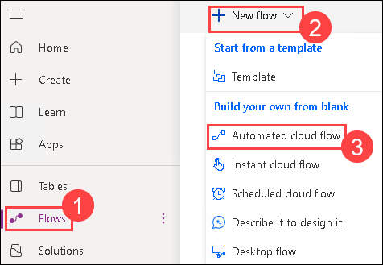

1. Enter the below name for your flow.
 
   ```
   New device approval request
   ```
   
   

1. In the **Choose your flow’s trigger** box, search for when a row is added and select **When a row is added**
    **modified, or deleted**.
    
   

1. Click on **Create**.
1. Select **Added** for Change type.

   
   
1. Click the **Table Name** drop-down and select **Device Orders**. You can type “device orders” to search for it.
   
1. Click the **Scope** drop-down and select **Organization**. 
  
   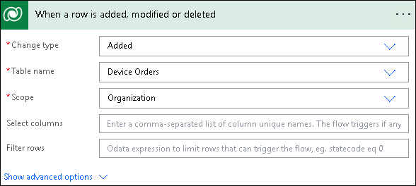
   
### Task 2 : Add action to send an approval request

1. Click on **+ New step**.

   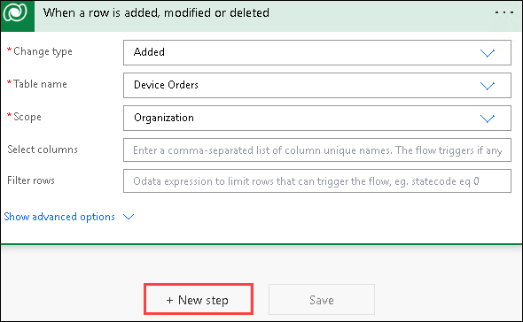
   
1. Search for **Approvals** and select **Start and wait for an approval** under **Actions**.

   

1. In the **Approval type** dropdown, select **Approve/Reject - First to Respond**.

   
   
1. For the Title, we will add some text and one variable. This variable will contain the Device Name of the device
    order request. Enter the below value in the **Title** text box.

   ```
   New device request for
   ```
   

1. Select **Device Name** from the **Dynamic content** pane.

     
           
1. Select the **Assigned to** field, select click **Approver**. Click on the **Add dynamic content** button to show/hide the
    dynamic content pane.

   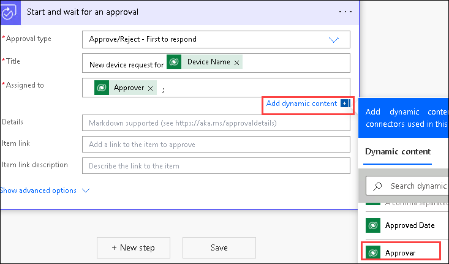
   
   > **Note:** If you get a warning message about this field being optional. Ignore it and ignore similar warnings in future.

1. Click on **Show Advanced Options**.

   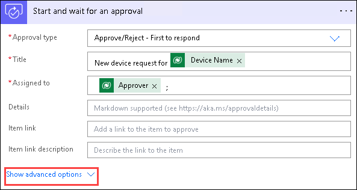
   
1. Select the **Requestor** field and select **Requested By**.

   
   
1. In the **Details** field, enter the below value and hit **Enter**.

   ```
   A new device has been requested
   ```
   
   
   
1. Select **Device Name** from the Dynamic content pane.
   
   
   
1. Type **_, $_** and select **Price.** You may need to click the **"See More"** option under the dynamic content search bar in
    order to see the Price option.
   
   
   
1. Hit Enter and insert the below value.

   ```
   Department Contribution: $
   ```
   
1. Select **Department Contribution**.

   

1. Hit Enter, type **_Comments:_** and select **Comments**.
 
   
   
1. **Save** your flow.

   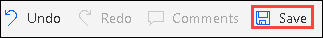


> **_Note_** _: When creating your own approval flows, you may additionally include a clickable link that will be displayed in the
approval email. In this scenario, for example, you could include a link to view device details in an online catalogue. You
would include the_ **_Item link_** _and_ **_Item link description_**_._

> **_Note_** _: You could also set the_ **_Item link_** _to deep link into a Power Apps app to view more details about the request. In this
scenario, you might pass an OrderID or a DeviceID as a URL parameter. Power Apps accepts URL parameters, you can find more details about Flow 
Parameters Here: `https://powerapps.microsoft.com/tutorials/function-param/`

   
## Exercise 2: Conditional Logic

In flow, you can add conditions to take different actions depending on a certain result, in this case, whether the request
was approved or rejected.

### Task 1: Add conditional logic to flow

1. Click on **+ New step**.
   
       
   
1. Search for **Condition** and select it.
   
       

1. Click on the box that says `Choose a value` and you will get a list of values. Select **Outcome**.

     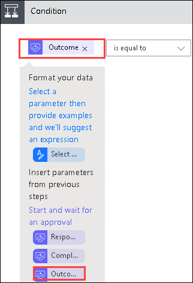

1. Select **is equal to** for condition and type **Approve** for **Value**.

       

   
### Task 2: Add conditional logic to flow

1. In the left **If yes** box, click **Add an action**.

     

1. Search for **Update a Row** and select **Update a Row Microsoft Dataverse**.
   
      
   
1. Select **Device Orders** for **Table Name**.
   
1. Click on the **Row ID** and select Device Order from the Dynamic content pane.

      

   > This is the unique lookup ID for the record (or row) that was created.
   
1. Select **Approve** from the **Approval Status** drop-down.

     

1. Select the **Approved Date** field and select the **Expression** tab.
   
     
   
1. From the Dynamic content pane, select the **expression** tab and enter the below value. Then, click **OK**.
   ```
   utcNow()
   ```
     

    > **Note:** If you are unable to get the Expressions tab, please follow the below steps:

      - Click on the nine dots from the top left and click on **Power Automate**.

           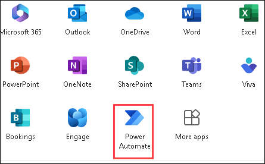

      - Click on **My flows (1)** and click on Edit on the **flow (2)** that we have created.

         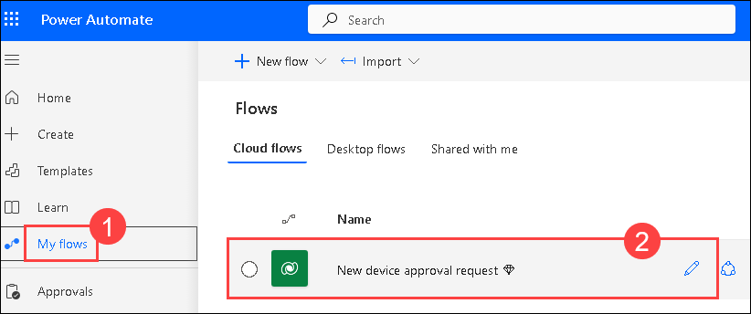      
      
      - Navigate to the **Update a row** in the Condition action and click on **Show All**.

         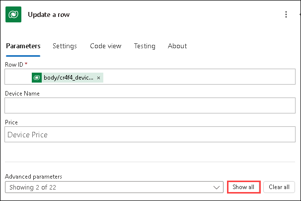           
      
      - Select the **Approved Date** field and select the **Expression** tab.
   
           

           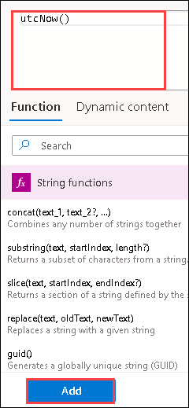                  
 
      - Once done, **save** the flow and navigate back to the Power Platform.

1. **Save** the flow.

### Task 3: Add another action

You will now add the send email action to the If Yes branch.

1. From within the yes branch, Click **Add an Action**.
   
     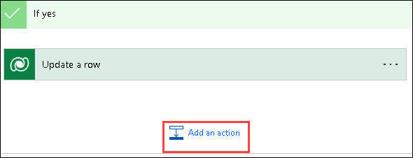  

1. Search for **send email (v2) (1)** and select **Send an email (V2) – Office 365 Outlook (2)**.
   
     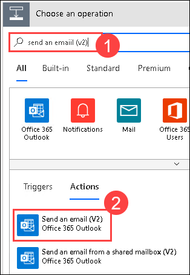  
   
1. Click on **Sign in** if prompted.

      

1. Click on **Accept** if prompted.
   
      
  
1. Click on the **To** field and click on **Switch to Advanced Mode**.
   
     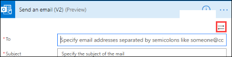  

1. Select **Requested By** for **To.** Select from under the **When a record is added** action.
   
      
   
1. Enter the below value in the **Subject** field.
   ```
   Your device order has been approved!
   ``` 
1. Click on the **Code View** button.
   
     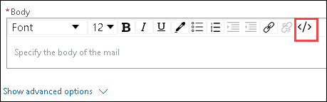  
   
1. Set the **Body** value as shown below:

    - Select **Device Name** and **Estimated Ship Date** from the **When a row is added** action.
   
         

1. Click on **Save**.

## Exercise 3: Test the cloud flow

To test the flow, you will:

  1. Run the Device Ordering app and submit an approval request
  1. Verify the request was sent to the approver
  1. Approve the request
  1. Verify that the Microsoft Dataverse record was updated, and an email was sent back to the requestor

### Task 1: Test the cloud flow

1. Select **Test** that is present at the top right corner, then **Manually** and click **Test**
   
     
   
1. To submit a device request, navigate to Power Apps Portal by using this URL `http://make.powerapps.com/`.
   
1. Select **Apps** and start the **Device Ordering App** by clicking on **Play** button.

     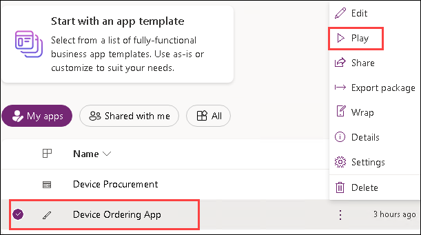  
   
1. Select a few devices and click on **Compare (1)** and **Compare 1 item(s)**.
   
     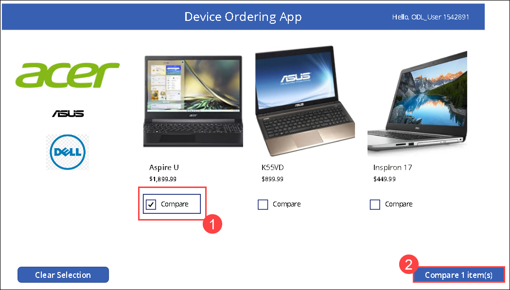 
   
1. Select one of the devices, provide **email** for Approver, provide a comment and click on **Submit device request**.
   
   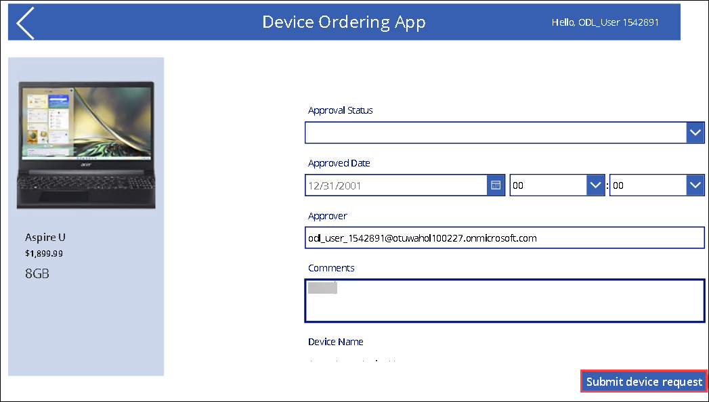  
   
1. Click **OK**.

1. The flow will run and send email to the ODL user email you have provided. The request for approval email will look like the image below; it will include **Device information** , **Price** , **Department Contribution (the calculated field),** and the **Requester Comment**.

   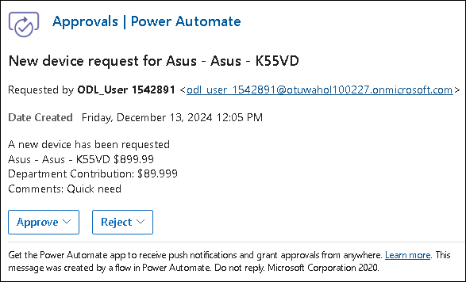  

    > **REMINDER :** If the flow does not run immediately, please wait, it may take up to ten minutes for the flow to be
triggered. To ensure the flow runs immediately, see note above - select the Test option in the top right and select
the “I’ll perform the trigger action” option. Then go ahead and submit a device request. The flow should run
immediately. The email, however, may take a few minutes to appear regardless of when the flow starts.

   > **Note:** If the workflow failed with timeout error as it might take up to ten minutes for the flow to be
triggered for the first time. Select **Test** that is present at the top right corner, then **Manually** and click **Test** again to test flow. Now, submit a device request from **Device Ordering App** to trigger the workflow.

1. Click on **Approve**. Add a comment and click on **Submit**.

   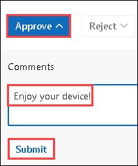  

1. The flow will continue to run; it will update the row and send an email to the requestor. The email sent to the requester will look like the image below.
   
     
   
1. Check the flow, you will notice that the flow is now marked as **Succeeded**.

   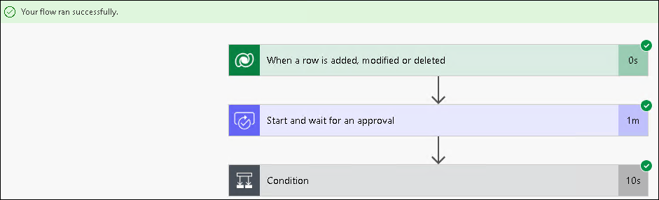  
   
## Exercise 4: Update the Flow

In this exercise, you will add two actions to the “if no” branch.

### Task 1: Add actions

1. If you don’t already have the flow open, open it in edit mode by clicking on **Edit button**.
   
1. In the **If no** branch, click on **Add an action**.
   
      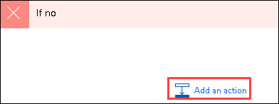  
   
1. Search for **Update a Row** and select **Update a Row (Dataverse)**

        
   
1. Select **Device Orders** for **Table Name** , select **Device Order** for **Row ID** , and click **Show advanced options**.
   
      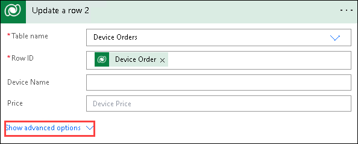  
   
1. Select **Reject** for **Approval Status**.
 
        
   
1. Click on **Add an action**.
   
1. Search for **_send email_** and select **Send an email (v2) - Office 365 Outlook**.

      

7. Provide the information shown on the image below. This will send an email to the requestor informing them that
    their device request was not approved. Select **Requested By** and **Device Name** from under the **When a record is**
    **added** header.
   
      
   
8. **Save** the flow.

### Task 2: Test the updated Flow

1. Click **Test** in the top right of the flow editor and start the Flow.
   
1. Run the Device Ordering app -> Select a device and submit an approval request.
   
1. You should receive an email with options to Approve or Reject the request. Select **Reject** this time and enter some
    comments, such as “Not eligible for new device.” Click **Submit**.
   
      
   
1. Confirm that the requestor receives an email informing them that their device approval request was rejected.

      

1. Navigate to [Make Power Apps](https://make.powerapps.com/) select **Apps** and start the **Device Procurement** application.

      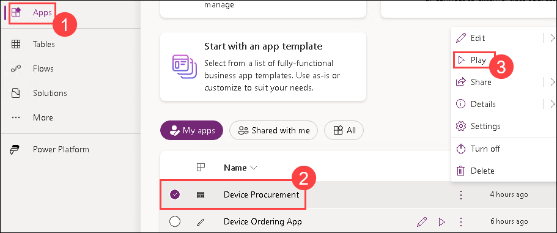  
   
1. Device Orders will now have the Approval Status.

      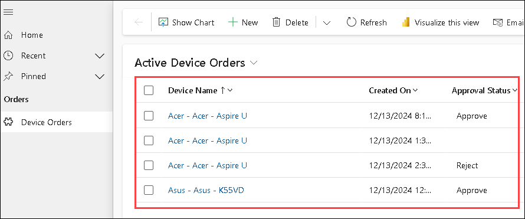   
   
### Task 3: Visit the approval center

1. Use the Device Ordering app to **submit a few more approval requests**.
   
1. Navigate to Power Automate using the below URL and make sure you are in the correct environment. Login with your lab credentials if
    prompted.
   
   ```
   https://flow.microsoft.com/
   ```
   
1. Expand **Action items** and select **Approvals**.Click on the pending approval request.

      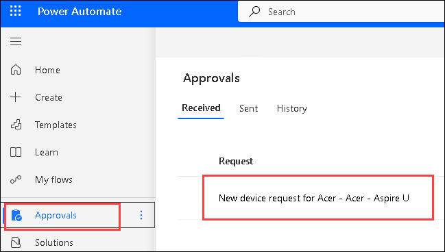  
   
1. Go ahead and approve or reject a request from this screen. The details are displayed in the right pane where you can **enter comments** and **Confirm**.
   
      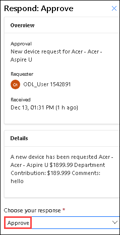 
   
1. The request will no longer be visible as it has been processed.

   > **_Note_** _: All approval requests sent to the current logged on user will be visible in the Approvals Center. This includes approvals
sent from any app or flow._

1. You can also use the Approvals Center to view all requests that you have sent and are **Awaiting response** from
    the approver. Select the **Sent requests** tab at the top to view all requests that you have sent.
   
### You have successfully completed the lab
