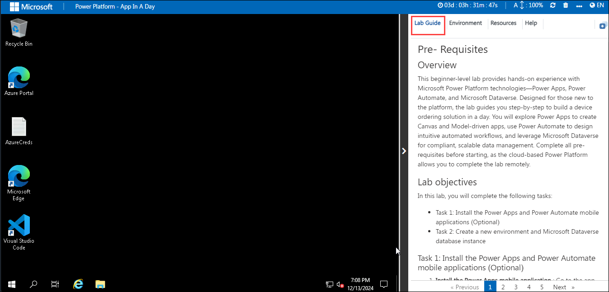
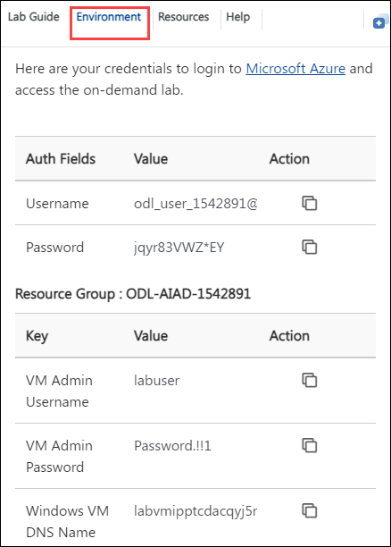
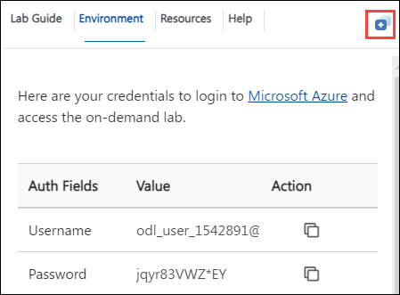
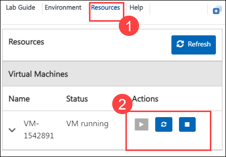

# Power Platform - App In A Day

### Overall Estimated Duration: 8 Hours

## Overview

This lab offers hands-on experience with Microsoft Power Platform technologies—Power Apps, Power Automate, and Microsoft Dataverse—to build a customized device ordering solution. Participants will create Canvas and Model-driven apps for browsing, comparing, and managing orders, design automated workflows for approvals using Power Automate, and securely store data with Microsoft Dataverse. The lab highlights practical application through step-by-step guidance, enabling participants to streamline procurement processes and craft robust, no-code solutions while exploring intuitive app design, workflow automation, and data management.

## Objective

By the end of this lab, you will :

- **Power Apps Canvas App** : This lab demonstrates how citizen developers can use Power Apps, Power Automate, and Microsoft Dataverse to build a seamless, customized device ordering solution with tailored workflows and secure data management.
- **Microsoft Dataverse**: In this lab, you will use Microsoft Dataverse to model and store data for a device ordering app and build a model-driven app for back-office staff, leveraging the same framework as Microsoft Dynamics 365 apps.
- **Power Apps Model-driven App**: In this lab, you will build model-driven apps using focused designers like View, Form, Dashboard, Sitemap, Business Process Flow, Table, and App Designer to create a robust and user-friendly application.
- **Power Automate**: This lab explores designing and implementing a customized device ordering solution using Power Apps, Power Automate, and Microsoft Dataverse for streamlined, no-code development.

## Pre-requisites

- Fundamental knowledge of Power Platform
- Basic understanding of data management concepts, logical workflows, and app interfaces

## Getting Started with Your Lab Environment
 
Welcome to your Power Platform - App in a Day! We've prepared a seamless environment for you to explore and learn about these services. Let's begin by making the most of this experience.
 
## Accessing Your Lab Environment
 
Once you're ready to dive in, your virtual machine and lab guide will be right at your fingertips within your web browser.

   

### Virtual Machine & Lab Guide
 
 Your virtual machine is your main tool throughout the workshop. The lab guide is your roadmap to success.
 
## Exploring Your Lab Resources
 
To get a better understanding of your lab resources and credentials, navigate to the **Environment** tab.
 
   
 
## Utilizing the Split Window Feature
 
For convenience, you can open the lab guide in a separate window by clicking on the **Split Window** button in the top right corner.
 
   
 
## Managing Your Virtual Machine
 
Feel free to **start, stop, or restart (2)** your virtual machine as needed from the **Resources (1)** tab. Your experience is in your hands!

   

## Support Contact

1. The CloudLabs support team is available 24/7, 365 days a year, via email and live chat to ensure seamless assistance at any time. We offer dedicated support channels tailored specifically for both learners and instructors, ensuring that all your needs are promptly and efficiently addressed.

   Learner Support Contacts:

   - Email Support: cloudlabs-support@spektrasystems.com
   - Live Chat Support: https://cloudlabs.ai/labs-support

1. Now, click on Next from the lower right corner to move on to the next page.
   
## Happy Learning!!
